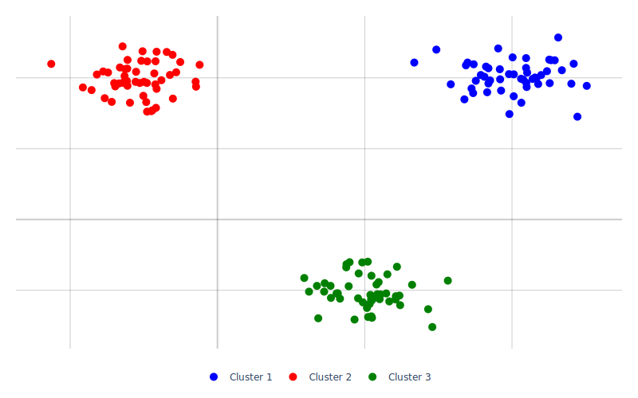

# 1.3 Überwachtes Lernen (Supervised Learning)

Überwachtes Lernen ist ein Ansatz im maschinellen Lernen, bei dem Modelle anhand von Eingabe- und Ausgabedaten trainiert werden. Das bedeutet, dass das Modell während des Trainings bereits mit den richtigen Antworten versorgt wird. Diese Art des Lernens eignet sich für Aufgaben wie Klassifikationen und Regressionen.

Dieses Kapitel befasst sich mit dem überwachten Lernen. Zu Beginn wird auf die Unterscheidung zwischen Regression und Klassifikation eingegangen. Anschießend werden die Konzepte hinter linearen und logistischen Regressionen, der Funktionsweise von Entscheidungsbäumen, Support Vector Machines, Ensemble-Methoden und k-Nearest Neighbors vorgestellt.

[Quelle/weitere Infos](https://cloud.google.com/discover/what-is-supervised-learning), [Quelle/weitere Infos 2](https://www.ibm.com/topics/supervised-learning)

#### 1.3.1 **Regression vs. Klassifikation**

Klassifikation und Regression sind zwei grundlegende Aufgaben im überwachten maschinellen Lernen. Obwohl beide dazu dienen, Vorhersagen zu treffen, gibt es entscheidende Unterschiede zwischen ihnen.

**Regression:** Regression hat zum Ziel, kontinuierliche numerische Werte oder eine reale Zahl als Ausgabe vorherzusagen. Zum Beispiel die Vorhersage des Preises eines Hauses basierend auf seinen Merkmalen (Größe, Anzahl Zimmer, Lage, …) oder die Prognose der Temperatur anhand von meteorologischen Daten.

In der Regression ist die Ausgabe kontinuierlich und numerisch. Sie kann jeden Wert innerhalb eines Wertebereichs annehmen. Die Ausgabe könnte zum Beispiel ein Wert wie 25,5 Grad Celsius oder 105.000 Euro sein. In der Regression werden metrische Bewertungskriterien wie der mittlere quadratische Fehler (Mean Squared Error, MSE) oder der mittlere absolute Fehler (Mean Absolute Error, MAE) verwendet. Vorhersage von Aktienkursen, Schätzung des zukünftigen Umsatzes eines Unternehmens, Vorhersage der Länge eines Fisches basierend auf seinen Merkmalen sind einige Beispiele für Regressionsprobleme.

<figure><figcaption><p>Abbildung 2: Regressionsbeispiel zur Vorhersage der Datenpunkte durch eine optimale Anpassungsfunktion</p></figcaption></figure>

**Klassifikation:** Die Klassifikation zielt darauf ab, Eingaben in vordefinierte Klassen oder Kategorien einzuordnen. Zum Beispiel, die Einteilung von E-Mails in "Spam" und "Nicht-Spam" oder die Erkennung von Krankheiten basierend auf medizinischen Tests.

In der Klassifikation ist die Ausgabe diskret und kategorisch. Es handelt sich um eine Klassenbezeichnung, die eine der vordefinierten Kategorien darstellt. Die Ausgabe könnte zum Beispiel "Ja" oder "Nein", "Katze", "Hund" oder "Maus" sein. In der Klassifikation werden metrische Bewertungskriterien wie Genauigkeit, Präzision, Recall und F1-Score verwendet.

Die Erkennung von Personen oder Straßenschildern, Betrugserkennung in Finanztransaktionen oder Genrezuweisung von Liedern sind einige Beispiele für Klassifikationsprobleme sind.

<figure><figcaption><p>Abbildung 3: Klassifikation dreier Punktwolken</p></figcaption></figure>

**1.3.2** **Lineare Regression**

Die lineare Regression ist eine grundlegende statistische Methode, die verwendet wird, um die Beziehung zwischen einer abhängigen Variablen (Y) und unabhängigen Variablen (X) zu modellieren. Sie findet Anwendung in verschiedenen Bereichen, insbesondere wenn es darum geht, Vorhersagen basierend auf numerischen Daten zu treffen.

<figure><figcaption><p>Abbildung 4: Vorhersage der Datenpunkte durch eine lineare Anpassungsfunktion</p></figcaption></figure>

Folgende Eigenschaften weißt die lineare Regression auf:

* Mathematische Darstellung: Y = aX + b (a ist die Steigung, b der Y-Achsenabschnitt).
* Während des Trainingsprozesses werden die besten Werte für die lernbaren Parameter a und b gefunden, um eine optimale Anpassung an die Daten zu erreichen.
* Ein klassisches Beispiel ist die Vorhersage von Hauspreisen basierend auf Merkmalen wie Größe und Lage.

**Vorteile:**

* **Einfachheit und Interpretierbarkeit:** Die lineare Regression ist einfach zu verstehen und zu interpretieren, da sie eine klare mathematische Formel hat.
* **Effizienz:** Das Training und die Vorhersage mit linearen Regressionen sind in der Regel schnell und erfordern wenig Rechenleistung.
* **Anwendbarkeit auf kontinuierliche Variablen:** Die lineare Regression ist besonders gut geeignet für Vorhersagen, die auf kontinuierlichen Variablen beruhen.

**Nachteile:**

* **Linearität:** Die lineare Regression setzt voraus, dass die Beziehung zwischen den Variablen linear ist, was in vielen realen Problemen nicht der Fall ist.
* **Sensibilität gegenüber Ausreißern:** Ausreißer in den Daten können die Leistung der linearen Regression erheblich beeinträchtigen, da sie stark von den durchschnittlichen Datenpunkten beeinflusst wird.
* **Einschränkung auf lineare Beziehungen:** Da die lineare Regression nur lineare Beziehungen modellieren kann, ist sie in komplexen Problemen mit nicht-linearen Beziehungen weniger effektiv.

[Quelle/weitere Infos](https://machinelearningmastery.com/linear-regression-for-machine-learning/), [Quelle/weitere Infos 2](https://www.geeksforgeeks.org/ml-linear-regression/)

```python
import numpy as np
from sklearn.linear_model import LinearRegression

# Daten vorbereiten
X = np.array([1, 2, 3, 4, 5]).reshape(-1, 1)
Y = np.array([100, 150, 200, 250, 300])

# Modell erstellen und trainieren
model = LinearRegression()
model.fit(X, Y)

# Vorhersagen treffen
predicted = model.predict(X)

# Modellparameter ausgeben
slope = model.coef_[0]
intercept = model.intercept_

print("Steigung (a):", slope)
print("Y-Achsenabschnitt (b):", intercept)
```

#### 1.3.3 **Logistische Regression**

Die logistische Regression ist eine Klassifikationsmethode, die die Wahrscheinlichkeit einer Zugehörigkeit zu einer bestimmten Klasse berechnet. Dieser Ansatz ist besonders nützlich in Situationen, in denen zwischen zwei oder mehr Klassen entschieden werden soll.

<figure><figcaption><p>Abbildung 5: Klassifikation von Datenpunkten in zwei Klassen, anhand einer Entscheidungsfunktion</p></figcaption></figure>

Folgende Eigenschaften weißt die logistische Regression auf:

* Verwendet die Logit-Funktion zur Modellierung der Wahrscheinlichkeit einer Zugehörigkeit.
* In der Logit-Funktion werden Gewichtungen (_w_) für die Modellparameter auf die Eingabe (_x_) angewendet, zusammen mit einem Bias (_b_).
* Basierend auf der Sigmoid-Funktion, werden Wahrscheinlichkeitswerte zwischen 0 und 1 erzeugt.
* Ideal für Klassifikationsaufgaben, wie Spam-E-Mail-Erkennung oder Vorhersage von krankheitsbezogenen Ereignissen.
* Ein spezifischer Algorithmus innerhalb des breiteren Aufgabentyps der Klassifikation.

**Vorteile:**

* **Einfachheit und Effizienz:** Die logistische Regression ist einfach zu implementieren und effizient in der Berechnung.
* **Interpretierbarkeit:** Die Ergebnisse der logistischen Regression sind leicht interpretierbar, da die Wahrscheinlichkeiten direkt interpretiert werden können.
* **Geringer Rechenaufwand:** Im Vergleich zu komplexeren Algorithmen erfordert die logistische Regression weniger Rechenressourcen.

**Nachteile:**

* **Einschränkung auf lineare Entscheidungsgrenzen:** Die logistische Regression ist nur in der Lage, lineare Entscheidungsgrenzen zu modellieren, was ihre Anwendung in komplexen Klassifikationsproblemen einschränken kann.
* **Anfälligkeit für Ausreißer:** Die logistische Regression kann empfindlich auf Ausreißer reagieren, was die Vorhersageleistung beeinträchtigen kann.
* **Abhängigkeit von der Merkmalsauswahl:** Die Vorhersageleistung der logistischen Regression hängt stark von der Qualität und Relevanz der ausgewählten Merkmale ab.

[Quelle/weitere Infos](https://www.kdnuggets.com/2022/04/logistic-regression-classification.html), [Quelle/weitere Infos 2](https://builtin.com/articles/logistic-classifier)

```python
import numpy as np
from sklearn.linear_model import LogisticRegression

# Daten vorbereiten
X = [[90, 1], [85, 2], [60, 3], [75, 2], [95, 1]]
Y = [1, 1, 0, 1, 1]

# Modell erstellen und trainieren
model = LogisticRegression(solver='liblinear')
model.fit(X, Y)

# Vorhersagen treffen
predictions = model.predict(X)
print("Vorhersagen:", predictions)
```

#### 1.3.4 **Entscheidungsbäume (Decision Trees)**

Ein Entscheidungsbaum ist ein hierarchisches Modell, das zur Klassifikation und Regression verwendet wird. Er zerlegt die Daten in eine Baumstruktur, bestehend aus Entscheidungsknoten und Blättern. Jeder Entscheidungsknoten repräsentiert eine Frage oder Bedingung, die auf die Merkmale der Daten angewendet wird. Jedes Blatt entspricht einer Klasse oder einem numerischen Wert, der die Vorhersage darstellt.

Im Folgenden wird der Aufbau, der Trainingsprozess und die Vorhersage von Entscheidungsbäumen eingegangen:

* **Aufbau eines Entscheidungsbaums**
  * **Wurzelknoten**: Der Wurzelknoten ist der oberste Knoten des Baums und stellt die erste Entscheidung dar. Hier wird die Eingabe anhand eines Merkmals geteilt.
  * **Innere Knoten**: Innere Knoten sind nachfolgende Entscheidungspunkte im Baum, die die Eingabe weiter aufteilen. Jeder innere Knoten stellt eine Bedingung auf einem bestimmten Merkmal dar.
  * **Blätter**: Blätter des Baums sind Endknoten, die die Vorhersage repräsentieren. Für Klassifikationsaufgaben entspricht jeder Blattklasse einer bestimmten Klasse. In Regressionsaufgaben entspricht das Blatt einem numerischen Wert.
*   **Trainingsprozess eines Entscheidungsbaums**

    Der Trainingsprozess zielt darauf ab, den Entscheidungsbaum zu erstellen, der die Daten am besten repräsentiert. Dabei werden folgende Schritte durchgeführt:

    1. **Auswahl des besten Merkmals**: In jedem Knoten wird das beste Merkmal ausgewählt, um die Daten zu teilen. Dies erfolgt anhand von Kriterien wie [Gini-Unreinheit](https://www.ibm.com/de-de/topics/decision-trees) (für Klassifikation) oder Mean Squared Error (für Regression).
    2. **Teilung der Daten**: Die Daten werden anhand des ausgewählten Merkmals in Teilgruppen aufgeteilt. Angenommen, das ausgewählte Merkmal ist beispielsweise die "Alter" in einem Datensatz von Personen. Der Entscheidungsbaum würde nun die Daten in Gruppen aufteilen, basierend auf diesem Merkmal. Zum Beispiel könnten alle Personen über 30 Jahre in einer Gruppe und alle unter 30 Jahre in einer anderen Gruppe landen.
    3. **Rekursive Wiederholung**: Dieser Prozess wird rekursiv für jede Teilgruppe fortgesetzt, bis eine Abbruchbedingung erreicht wird. Die Abbruchbedingung kann beispielsweise die maximale Tiefe des Baums oder die Mindestanzahl von Datenpunkten in einem Blatt sein.
*   **Vorhersage mit Entscheidungsbäumen**

    Um eine Vorhersage für einen neuen Datenpunkt zu treffen, wird der Baum von der Wurzel bis zu einem Blatt durchlaufen. An jedem Knoten wird die entsprechende Bedingung ausgewertet, und je nach dem Ergebnis wird in den linken oder rechten Zweig des Baums verzweigt. Wenn ein Blatt erreicht wird, gibt es die Vorhersage aus.

    [Quelle/weitere Infos](https://www.analyticsvidhya.com/blog/2021/08/decision-tree-algorithm/), [Quelle/weitere Infos 2](https://www.ibm.com/topics/decision-trees), [Quelle/weitere Infos 3](https://www.mastersindatascience.org/learning/machine-learning-algorithms/decision-tree/)

```python
import tensorflow as tf
import tensorflow_decision_forests as tfdf
import pandas as pd
from sklearn.model_selection import train_test_split
from sklearn.metrics import accuracy_score

# Laden des Beispiel-Datensatzes (Iris-Datensatz)
iris = pd.read_csv("<https://storage.googleapis.com/download.tensorflow.org/data/iris.csv>")
X = iris.drop('species', axis=1)
y = iris['species']

# Aufteilung des Datensatzes in Trainings- und Testdaten
X_train, X_test, y_train, y_test = train_test_split(X, y, test_size=0.3, random_state=42)

# Konvertieren in TensorFlow-Datensätze
train_data = tf.data.Dataset.from_tensor_slices((dict(X_train), y_train))
test_data = tf.data.Dataset.from_tensor_slices((dict(X_test), y_test))

# Erstellung eines Entscheidungsbaummodells mit TensorFlow Decision Forests
model = tfdf.keras.RandomForestModel(task=tfdf.keras.Task.CLASSIFICATION)

# Training des Modells
model.fit(train_data)

# Auswertung auf den Testdaten
test_predictions = model.predict(test_data)
accuracy = accuracy_score(y_test, test_predictions)
print("Genauigkeit des Entscheidungsbaums mit TensorFlow Decision Forests:", accuracy
```

<figure><figcaption><p>Abbildung 6: Aufbau eines Entscheidungsbaumes</p></figcaption></figure>

Angenommen, wir haben einen neuen Datenpunkt mit dem Wert **`x = 4.5`**. Um eine Vorhersage für diesen Datenpunkt zu treffen, durchlaufen wir den Entscheidungsbaum von der Wurzel bis zu einem Blatt.

1. Zuerst überprüfen wir die Bedingung an der Wurzel: **`x > 3`**.
   * Da **`x = 4.5`** größer als 3 ist, gehen wir nach links zum nächsten Knoten.
2. An diesem Knoten überprüfen wir die Bedingung: **`x > 4`**.
   * Da **`x = 4.5`** größer als 4 ist, gehen wir erneut nach rechts zum nächsten Knoten.
3. An diesem Knoten gibt es keine weiteren Bedingungen, also erreichen wir ein Blatt.
   * Das Blatt sagt uns, dass die Vorhersage für diesen Datenpunkt "5" ist.

Basierend auf dem durchlaufenen Pfad des Entscheidungsbaums lautet die Vorhersage für den neuen Datenpunkt mit **`x = 4.5`** also "5".

#### 1.3.5 Ensemblemethoden und **Random Forest**

Ensemblemethoden sind ein übergeordneter Begriff für Techniken im maschinellen Lernen, bei denen mehrere Modelle kombiniert werden, um die Vorhersagegenauigkeit zu verbessern. Dieser Ansatz basiert auf dem Prinzip, dass die Kombination mehrerer unabhängig voneinander trainierte Modelle oft zu besseren Ergebnissen führen als die Verwendung eines einzelnen Modells (Mehrheitsentscheidung, Durchschnittsbildung). Ensemble Methods können verschiedene Algorithmen und Modelle verwenden, wie bspw. Entscheidungsbäume, lineare Modelle oder neuronale Netze.

<figure><figcaption><p>Abbildung 7: Prizipielle Funktionsweise eines Random Forest Modells</p></figcaption></figure>

Random Forests sind eine Erweiterung von Entscheidungsbäumen und gehören zu den sogenannten Ensemble-Methoden. Sie kombinieren die Vorhersagen mehrerer Entscheidungsbäume, um die Vorhersagegenauigkeit zu steigern. Im Folgenden wird als Beispiel für Ensemble-Methoden das Funktionsprinzip von Random Forests vorgestellt:

* **Arbeitsweise von Random Forests:**
  1. **Bootstrapping (Stichprobenziehung mit zurücklegen):** In diesem Prozess wird eine zufällige Teilmenge aus einem Datensatz gezogen, wobei jeder Datenpunkt nach dem Ziehen zurückgelegt wird. Das bedeutet, dass derselbe Datenpunkt mehrmals ausgewählt oder auch überhaupt nicht ausgewählt werden kann. Die entstandene zufällige Teilmenge wird als Bootstrapsatz bezeichnet. Um es auf Daten anzuwenden: Zufällig werden Datenpunkte aus einem Datensatz ausgewählt, wobei jeder Punkt nach der Auswahl zurückgelegt wird. Diese zufällige Teilmenge wird dann für das Training jedes einzelnen Entscheidungsbaums im Random Forest verwendet. Durch dieses Vorgehen entsteht Vielfalt, da jeder Baum auf einer etwas anderen Auswahl von Datenpunkten basiert.
  2. **Zufällige Merkmalsauswahl**: Für jeden Entscheidungsbaum werden zufällig ausgewählte Merkmale verwendet, um die Daten in jedem Knoten zu teilen. Dies reduziert die Korrelation zwischen den Bäumen.
  3. **Erstellung von Entscheidungsbäumen**: Mehrere Entscheidungsbäume werden parallel erstellt, indem sie auf den Bootstrapsätzen und den ausgewählten Merkmalen trainiert werden.
  4. **Vorhersageaggregation**: Die Vorhersagen der einzelnen Bäume werden aggregiert, um die endgültige Vorhersage zu treffen. In Klassifikationsaufgaben erfolgt dies oft durch Mehrheitsabstimmung, in Regressionsaufgaben durch Durchschnittsbildung.

Entscheidungsbäume sind eigenständige Algorithmen, einfach zu interpretieren, neigen jedoch zu Overfitting. Random Forests sind eine Sammlung von Entscheidungsbäumen, reduzieren Overfitting und bieten höhere Vorhersagegenauigkeit. Einzelne Entscheidungsbäume haben eine niedrige Modellkomplexität. Random Forests sind aufgrund der Kombination mehrerer Bäume komplexer als Einzelbäume.

**Vorteile:**

* Reduziert Überanpassung (Overfitting), da die Bäume unterschiedlich sind.
* Hohe Vorhersagegenauigkeit durch die Kombination mehrerer Modelle.
* Robust gegenüber Ausreißern und Rauschen in den Daten.

**Nachteile:**

* **Komplexität:** Durch die Kombination mehrerer Bäume sind Random Forests tendenziell komplexer als Einzelbäume, was zu erhöhtem Rechenaufwand führen kann, insbesondere bei großen Datensätzen.
* **Interpretierbarkeit:** Obwohl Entscheidungsbäume an sich einfach zu interpretieren sind, wird die Interpretation von Random Forests aufgrund ihrer Ensemble-Natur schwieriger, da sie aus einer Vielzahl von Bäumen bestehen.

Random Forests sind besonders nützlich in komplexen Datenszenarien und haben breite Anwendungsbereiche, einschließlich der Analyse von Kundenverhalten, medizinischer Diagnosen und der Erkennung von Spam-E-Mails.

[Quelle/weitere Infos](https://www.analyticsvidhya.com/blog/2021/06/understanding-random-forest/), [Quelle/weitere Infos 2](https://www.ibm.com/topics/random-forest), [Quelle/weitere Infos 3](https://www.bigdata-insider.de/was-ist-random-forest-a-913937/)

```python
import pandas as pd
from sklearn.model_selection import train_test_split
from sklearn.ensemble import RandomForestClassifier
from sklearn.metrics import accuracy_score

# Laden des Beispiel-Datensatzes (Iris-Datensatz)
iris = pd.read_csv("<https://storage.googleapis.com/download.tensorflow.org/data/iris.csv>")
X = iris.drop('species', axis=1)
y = iris['species']

# Aufteilung des Datensatzes in Trainings- und Testdaten
X_train, X_test, y_train, y_test = train_test_split(X, y, test_size=0.3, random_state=42)

# Erstellung eines Random-Forest-Modells mit scikit-learn
model = RandomForestClassifier()

# Training des Modells
model.fit(X_train, y_train)

# Auswertung auf den Testdaten
test_predictions = model.predict(X_test)
accuracy = accuracy_score(y_test, test_predictions)
print("Genauigkeit des Random Forests mit scikit-learn:", accuracy)
```

#### 1.3.6 **Support Vector Machine (SVM)**

SVM ist ein leistungsstarker Klassifikationsalgorithmus, der besonders nützlich ist in komplexen, hochdimensionalen Datensätzen. Die Folgenden Punkte erklären das grundlegende Funktionsprinzip von Support Vector Machines:

* **Maximierung des Abstands:** SVM sucht nach der optimalen Trennlinie zwischen Datenpunkten verschiedener Klassen und maximiert den Abstand zu den Support Vektoren. Support-Vektoren sind die Datenpunkte in einem Datensatz, die am nächsten zur Trennlinie (oder Hyperebene in höheren Dimensionen) liegen und deren Position die Lage der Trennlinie bestimmt.
* **Flexible Anpassung:** SVM kann auch mit nicht-linearen Daten umgehen, indem es diese in einen höherdimensionalen Raum transformiert. Dies wird durch Kernel-Tricks wie den linearen, RBF- und Polynom-Kernel erreicht.
* **Effektive Klassifikation:** Nach dem Training kann SVM neue Datenpunkte zuverlässig klassifizieren, was sie besonders nützlich bei komplexen und hochdimensionalen Daten macht, sowohl für binäre als auch Multiklassen-Klassifikation.

<figure><figcaption><p>Abbildung 8: Trennung zweier Klassen mithilfe des SVM-Algorithmus</p></figcaption></figure>

SVM ist besonders nützlich bei Datensätzen, in denen eine klare Trennung zwischen den Klassen besteht. Es wird häufig in der Bilderkennung, Gesichtserkennung, medizinischen Diagnose und Textklassifikation eingesetzt.

**Vorteile:**

* **Effektive Nutzung von hochdimensionalen Räumen:** SVM ist in der Lage, auch in hochdimensionalen Räumen zu arbeiten, was sie besonders für komplexe Datensätze geeignet macht, in denen einfache lineare Modelle versagen könnten.
* **Gute Leistung auch bei kleinen Trainingsdatensätzen:** Aufgrund der Fokussierung auf die Support Vektoren und der Maximierung des Abstands zwischen den Klassen kann SVM auch mit kleinen Trainingsdatensätzen effektiv arbeiten.
* **Flexibilität durch Kernel-Tricks:** SVM kann mit nicht-linearen Daten umgehen, indem es sie in höhere Dimensionen transformiert, wodurch komplexe Entscheidungsgrenzen modelliert werden können.

**Nachteile:**

* **Empfindlich gegenüber der Wahl der Kernel-Parameter:** Die Leistung von SVM kann stark von der Auswahl und Einstellung der Kernel-Parameter abhängen, was eine gewisse Expertise erfordert und zu Overfitting führen kann.
* **Rechenintensivität bei großen Datensätzen:** SVM kann bei großen Datensätzen rechenintensiv sein, insbesondere wenn nichtlineare Kernel verwendet werden, da die Berechnung der Entscheidungsfunktionen in höherdimensionalen Räumen aufwendig sein kann.

[Quelle/weitere Infos](https://www.geeksforgeeks.org/support-vector-machine-algorithm/), [Quelle/weitere Infos 2](https://www.bigdata-insider.de/was-ist-eine-support-vector-machine-a-880134/)

```python
from sklearn.datasets import load_iris
from sklearn.model_selection import train_test_split
from sklearn.svm import SVC
from sklearn.metrics import accuracy_score

# Laden des Iris-Datensatzes
iris = load_iris()
X = iris.data
y = iris.target

# Aufteilen der Daten in Trainings- und Testdaten
X_train, X_test, y_train, y_test = train_test_split(X, y, test_size=0.2, random_state=42)

# Erstellen eines SVM-Modells
svm_model = SVC(kernel='linear')

# Training des Modells
svm_model.fit(X_train, y_train)

# Vorhersagen auf Testdaten
y_pred = svm_model.predict(X_test)

# Evaluierung auf Testdaten
accuracy = accuracy_score(y_test, y_pred)
print("Genauigkeit des SVM-Modells:", accuracy)
```

#### 1.3.7 **k-Nearest Neighbors (k-NN)**

k-NN ist ein vielseitiger Algorithmus, der sowohl in Klassifikations- als auch in Regressionsproblemen eingesetzt wird. Das grundlegende Funktionsprinzip von k-Nearest Neighbors wird im folgenden beschrieben:

* **Nachbarschaftsprinzip:** Der Algorithmus basiert auf der Idee der "Nachbarschaft". Für die Vorhersage von neuen Datenpunkten sucht k-NN nach den k nächsten Nachbarn in den Trainingsdaten.
* **Klassifikation:** In der Klassifikation werden die k nächsten Nachbarn gezählt, um die Zugehörigkeit zu einer Klasse zu bestimmen. Der neue Datenpunkt wird der am häufigsten vorkommenden Klasse in der Nachbarschaft zugeordnet.
* **Regression:** Bei der Regression berechnet k-NN den Durchschnitt oder die gewichtete Summe der k nächsten Nachbarn, um eine Vorhersage zu treffen.
* **Berechnung der Nähe:** Die Euklidische Distanz wird oft verwendet, um die Ähnlichkeit zwischen Datenpunkten im Merkmalsraum zu messen. Dies ist das gängigste Maß und wird oft verwendet, wenn die Datenpunkte im Merkmalsraum numerisch sind und eine geometrische Interpretation haben. Je näher Datenpunkte beieinander liegen, desto ähnlicher sind sie.
* **Anpassung von "k":** Die Wahl von "k" beeinflusst die Leistung des Algorithmus. Ein zu kleines "k" kann unpräzise Vorhersagen erzeugen, während ein zu großes "k" die Vorhersagen zu allgemein machen kann.

<figure><figcaption><p>Abbildung 9: Zuordnung eines neuen Datenpunktes zu einer der 3 bekannten Klassen mithilfe des k-NN-Algorithmus</p></figcaption></figure>

k-NN ist vielseitig einsetzbar und eignet sich sowohl für Klassifikations- als auch für Regressionsprobleme. Es wird in vielen Bereichen wie Empfehlungssystemen, medizinischer Diagnose, Finanzanalysen und Mustererkennung verwendet, wo die Datenpunkte eine natürliche räumliche Struktur aufweisen und Nachbarschaftsinformationen von Bedeutung sind.

**Vorteile:**

* Einfachheit und Intuition: k-NN ist einfach zu verstehen und zu implementieren, da es auf einem intuitiven Prinzip basiert - der Ähnlichkeit zwischen Datenpunkten.
* Vielseitigkeit: k-NN kann sowohl für Klassifikations- als auch für Regressionsprobleme eingesetzt werden, was ihn zu einem vielseitigen Algorithmus macht.
* Keine explizite Modellannahme: k-NN macht keine Annahmen über die Verteilung der Daten und ist daher in vielen Situationen anwendbar.

**Nachteile:**

* Rechenintensivität bei großen Datensätzen: Da k-NN für jede Vorhersage die Distanz zu allen Trainingsdatenpunkten berechnen muss, kann er bei großen Datensätzen rechenintensiv werden.
* Empfindlichkeit gegenüber Ausreißern: k-NN kann empfindlich auf Ausreißer reagieren, da die Vorhersagen stark von den k nächsten Nachbarn abhängen.
* Wahl von "k": Die Leistung von k-NN ist stark von der Wahl des Parameters "k" abhängig, was eine sorgfältige Abstimmung erfordert.

[Quelle/weitere Infos](https://www.ibm.com/topics/knn), [Quelle/weitere Infos 2](https://www.geeksforgeeks.org/k-nearest-neighbours/)

```python
import tensorflow as tf
from sklearn.datasets import load_iris
from sklearn.model_selection import train_test_split
from sklearn.neighbors import KNeighborsClassifier

# Laden des Iris-Datensatzes
iris = load_iris()
X = iris.data
y = iris.target

# Aufteilung des Datensatzes in Trainings- und Testdaten
X_train, X_test, y_train, y_test = train_test_split(X, y, test_size=0.3, random_state=42)

# Erstellen des KNN-Modells
model = KNeighborsClassifier(n_neighbors=3)  # Anzahl der Nachbarn

# Training des Modells
model.fit(X_train, y_train)

# Auswertung auf den Testdaten
accuracy = model.score(X_test, y_test)
print("Genauigkeit des K-Nearest Neighbors-Modells:", accuracy)
```


