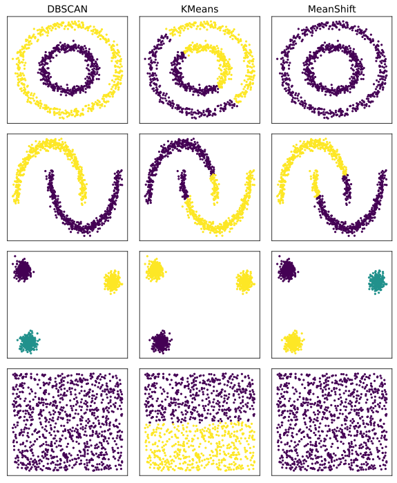
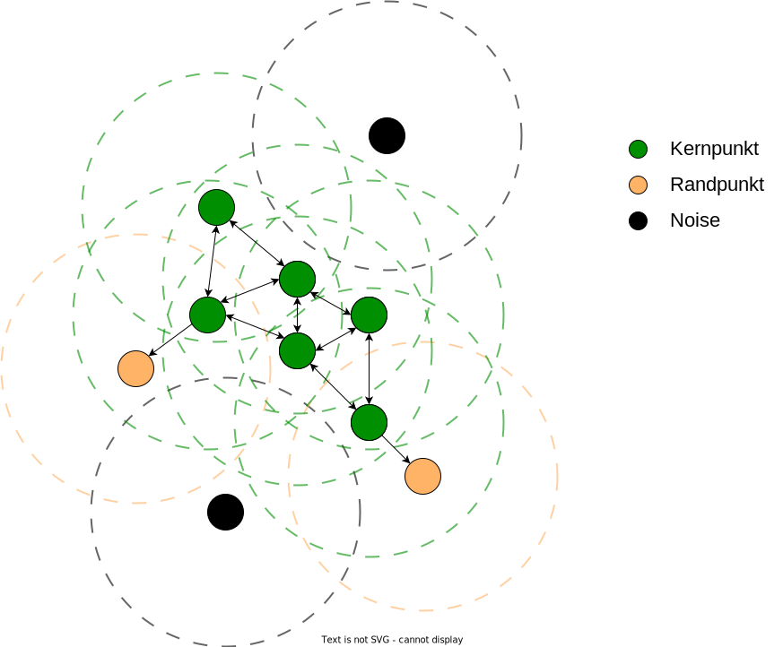
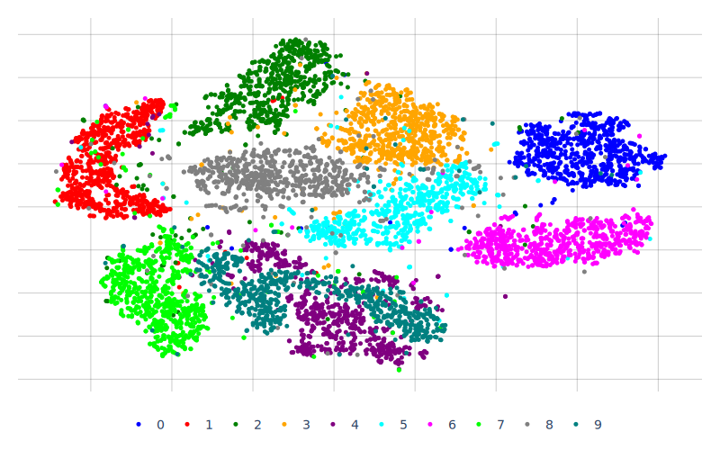
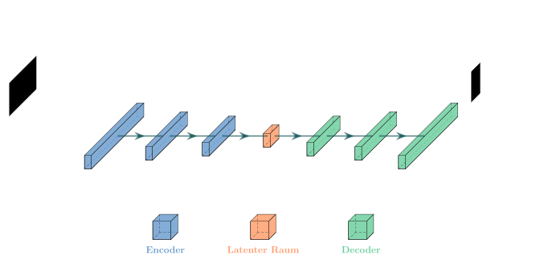
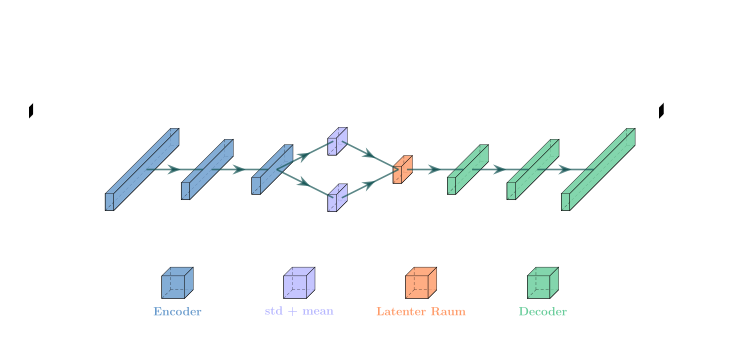

# 1.5 Unüberwachtes Lernen (Unsupervised Learning)

Unüberwachtes Lernen (engl. Unsupervised Learning), ist ein Bereich des maschinellen Lernens, in dem Algorithmen Muster in Daten erkennen, ohne dass ihnen vorab gelabelte Informationen zur Verfügung stehen. Im Gegensatz zum Supervised Learning, bei dem Modelle auf Basis von Eingabe-Ausgabe-Paaren trainiert werden, zielt Unsupervised Learning darauf ab, versteckte Strukturen und Zusammenhänge in den Daten aufzudecken. Zwei Hauptanwendungen im Unsupervised Learning sind Clustering und Dimensionsreduktion, welche im folgenden vorgestellt werden.

[Quelle/weitere Infos](https://www.ibm.com/de-de/topics/unsupervised-learning), [Quelle/weitere Infos 2](https://www.geeksforgeeks.org/supervised-unsupervised-learning/), \[Quelle/weitere Infos 3]\([https://cloud.google.com/discover/what-is-unsupervised-learning#:\~:text=Unsupervised learning in artificial intelligence,any explicit guidance or instruction.)](https://cloud.google.com/discover/what-is-unsupervised-learning)

#### 1.5.1 **Clustering Algorithmen (K-Means, Hierarchical Clustering)**

Clustering-Algorithmen sind Techniken im Bereich des maschinellen Lernens, die dazu dienen, ähnliche Datenpunkte in Gruppen zu organisieren. Ihr Ziel ist es, Muster und Strukturen in Daten zu identifizieren, indem sie diese in aussagekräftige Cluster unterteilen. In diesem Kapitel werden beispielhaft die Algorithmen k-Means und hierachical Clustering vorgestellt.

<figure><figcaption><p>Abbildung 10: Funktionsweise unterschiedlicher Clustering-Algorithmen bei unterschiedlichen Datenansammlungen</p></figcaption></figure>

**K-Means Clustering**

K-Means ist ein weit verbreiteter Clustering-Algorithmus, der Datenpunkte in “K” Gruppen oder Cluster unterteilt. Dabei versucht der Algorithmus, die Daten so aufzuteilen, dass die Ähnlichkeit innerhalb eines Clusters maximiert und die Ähnlichkeit zwischen den unterschiedlichen Clustern minimiert wird. Das Vorgehen ist wie folgt:

1. **Initialisierung der Clusterzentren:** Wähle zufällig K Startpunkte, die möglichst weit voneinander entfernt sind und die Anfangszentren der Cluster darstellen.
2. **Datenpunktzuweisung zu den nächsten Zentren:** Weise jedem Datenpunkt das Zentrum zu, das ihm am nächsten liegt.
3. **Aktualisierung der Clusterzentren:** Aktualisiere die Zentren der Cluster, indem der Durchschnitt der Datenpunkte in jedem Cluster berechnet wird.
4. **Iterative Clusterbildung:** Wiederhole die Schritte 2 und 3, bis sich die Cluster-Zuweisungen nicht mehr ändern oder eine bestimmte Anzahl von Iterationen erreicht ist.

<figure><figcaption><p>Abbildung 11: Clustern dreier Punktwolken mithilfe des k-Means Clustering</p></figcaption></figure>

K-Means eignet sich für Datensätze, bei denen die Anzahl der Cluster im Voraus bekannt sind, und die Cluster annähernd kugelförmig sind.

**Vorteile:**

* **Einfachheit und Effizienz:** K-Means ist einfach zu implementieren und schnell in der Ausführung, was ihn für große Datensätze geeignet macht.
* **Skalierbarkeit:** Der Algorithmus ist gut skalierbar und kann auch bei großen Datenmengen effizient arbeiten.
* **Anpassung an unterschiedliche Formen:** K-Means kann Cluster in verschiedenen Formen identifizieren, solange die Cluster gut voneinander getrennt sind.

**Nachteile:**

* **Empfindlichkeit gegenüber Anfangswerten:** Die Auswahl der Anfangszentren kann die Ergebnisse des Algorithmus stark beeinflussen, da er lokal nach dem nächstgelegenen Zentrum sucht.
* **Festlegung der Anzahl von Clustern:** Der Benutzer muss die Anzahl der Cluster im Voraus festlegen, was manchmal schwierig sein kann, insbesondere wenn keine klaren Informationen über die Datenstruktur vorliegen.
* **Ungeeignet für Cluster unterschiedlicher Größe und Dichte:** K-Means funktioniert gut für Cluster mit ähnlicher Größe und Dichte, kann aber Schwierigkeiten haben, Cluster mit unterschiedlichen Größen und Dichten zu identifizieren.

[Quelle/weitere Infos](https://realpython.com/k-means-clustering-python/), [Quelle/weitere Infos 2](https://www.analyticsvidhya.com/blog/2019/08/comprehensive-guide-k-means-clustering/), [Quelle/weitere Infos 3](https://towardsdatascience.com/understanding-k-means-clustering-in-machine-learning-6a6e67336aa1)

```python
import tensorflow as tf
from sklearn.datasets import load_iris
import numpy as np
import matplotlib.pyplot as plt

# Laden des Iris-Datensatzes
iris = load_iris()
X = iris.data

# Annehmen, dass K=3 Clusters
num_clusters = 3

# K-Means Clustering
kmeans = tf.keras.layers.KMeans(num_clusters, random_state=0)
kmeans.fit(X)

# Clusterzuweisungen
y_kmeans = kmeans.predict(X)

# Visualisierung der Cluster
plt.scatter(X[:, 0], X[:, 1], c=y_kmeans, cmap='viridis')
centers = kmeans.cluster_centers_
plt.scatter(centers[:, 0], centers[:, 1], c='red', s=200)
plt.show()
```

**Density-Based Spatial Clustering of Applications with Noise (DBSCAN)**

Das Grundprinzip von DBSCAN (Density-Based Spatial Clustering of Applications with Noise) basiert auf der Idee, Cluster anhand ihrer Dichte zu identifizieren. Hierbei werden Datenpunkte in Gruppen (Cluster) zusammengefasst, die in dichten Regionen liegen, während Punkte in weniger dichten Bereichen als Noise oder Ausreißer betrachtet werden. Dieser Ansatz ermöglicht es DBSCAN, Cluster verschiedener Formen und Größen effektiv zu erkennen und ist besonders nützlich in Datensätzen mit Rauschen. Hier sind die Kernaspekte des Algorithmus:

1. **Eps und MinPts festlegen:** Zwei Hauptparameter - Eps (der Radius um einen Punkt, um Nachbarn zu suchen) und MinPts (die minimale Anzahl von Punkten, die einen dichten Bereich bilden) - werden definiert.
2. **Kernpunkte identifizieren:** Punkte, die mindestens MinPts Nachbarn innerhalb des Radius Eps haben, werden als Kernpunkte klassifiziert.
3. **Randpunkte und Noise bestimmen:** Punkte, die weniger als MinPts Nachbarn haben, aber einem Kernpunkt nahe sind, gelten als Randpunkte. Punkte, die weder Kern- noch Randpunkte sind, werden als Noise betrachtet.
4. **Cluster bilden:** Kernpunkte und die ihnen zugeordneten Randpunkte bilden Cluster, während als Noise deklarierte Punkte ignoriert werden.
5. **Ergebnisanalyse:** Die entstandenen Cluster können analysiert und für weitere Datenanalysen verwendet werden.

<figure><figcaption><p>Abbildung 12: Bestandteile und Funktion des DBSCAN-Algorithmus</p></figcaption></figure>

DBSCAN eignet sich besonders für Datensätze, in denen die Anzahl der Cluster nicht bekannt ist und in denen Noise und Ausreißer vorhanden sind. Es erfordert keine Annahme über die Form der Cluster, was es vielseitig und robust in unterschiedlichen Anwendungsfällen macht.

**Vorteile:**

* **Robust gegenüber Rauschen und Ausreißern:** DBSCAN ist in der Lage, Ausreißer zu erkennen und zu ignorieren, was ihn besonders robust gegenüber Rauschen in den Daten macht.
* **Automatische Bestimmung der Anzahl von Clustern:** Im Gegensatz zu k-Means muss die Anzahl der Cluster bei DBSCAN nicht im Voraus festgelegt werden, da der Algorithmus automatisch Cluster identifiziert.
* **Erkennung von Clustern verschiedener Formen und Größen:** DBSCAN kann Cluster mit unterschiedlichen Formen und Größen effektiv erkennen, da er auf der Dichte basiert und nicht auf geometrischen Formen.

**Nachteile:**

* **Abhängigkeit von den Parametern Eps und MinPts:** Die Leistung von DBSCAN hängt stark von der Auswahl der Parameter Eps (Radius um einen Punkt) und MinPts (minimale Anzahl von Punkten in einem dichten Bereich) ab, was die Anpassung des Algorithmus an verschiedene Datensätze erschweren kann.
* **Schwierigkeit bei der Behandlung von Clustern unterschiedlicher Dichte:** DBSCAN kann Schwierigkeiten haben, Cluster zu identifizieren, die unterschiedliche Dichten aufweisen, insbesondere wenn die Parameter nicht optimal gewählt wurden.
* **Rechenintensität:** DBSCAN kann rechenintensiv sein, insbesondere für große Datensätze oder wenn die Datenpunkte hochdimensional sind, da für jeden Punkt die Distanz zu anderen Punkten berechnet werden muss.

[Quelle/weitere Infos](https://www.kdnuggets.com/2020/04/dbscan-clustering-algorithm-machine-learning.html), [Quelle/weitere Infos 2](https://www.geeksforgeeks.org/dbscan-clustering-in-ml-density-based-clustering/), [Quelle/weitere Infos 3](https://medium.com/mlearning-ai/dbscan-demystified-understanding-how-this-parameter-free-algorithm-works-89e03d7d7ab)

```python
import numpy as np
from sklearn.cluster import DBSCAN
from sklearn.datasets import make_moons
import matplotlib.pyplot as plt

# Generiere Beispieldaten
X, _ = make_moons(n_samples=500, noise=0.1, random_state=42)

# DBSCAN Clustering
dbscan = DBSCAN(eps=0.2, min_samples=10)
dbscan.fit(X)

# Cluster-Zuweisungen
labels = dbscan.labels_

# Identifiziere Core Samples
core_samples_mask = np.zeros_like(dbscan.labels_, dtype=bool)
core_samples_mask[dbscan.core_sample_indices_] = True

# Visualisierung
plt.scatter(X[:, 0], X[:, 1], c=labels, cmap='viridis', alpha=0.5)
plt.show()
```

**Mean Shift Clustering**

Der Mean Shift Algorithmus ist ein robustes, iteratives Verfahren, das darauf abzielt, die dichtesten Bereiche einer Verteilung zu finden, indem es die Datenpunkte in Richtung der Maxima ihrer Dichte verschiebt. Dieser Prozess wird ohne Annahme einer vorher bestimmten Anzahl von Clustern durchgeführt, was ihn besonders nützlich für Anwendungen macht, bei denen die Clusterstruktur im Voraus unbekannt ist. Hier sind die Kernaspekte des Algorithmus:

1. **Initialisierung durch Setzen von Fenstern:** Zu Beginn wird um jeden Datenpunkt ein Fenster gelegt. Die Größe dieser Fenster wird durch einen vorher festgelegten Wert, die sogenannte Bandbreite, bestimmt. Diese Fenster dienen dazu, die lokale Dichte der Daten zu untersuchen.
2. **Schätzung der lokalen Dichte:** Innerhalb jedes Fensters wird ermittelt, wie dicht die Datenpunkte beieinander liegen. Dies geschieht entweder durch einfaches Zählen der Punkte im Fenster oder durch eine Methode, bei der Punkte, die näher am Zentrum des Fensters liegen, stärker gewichtet werden. Dadurch erhält man ein Maß für die Dichte an jedem Punkt des Datensatzes.
3. **Anpassung der Fensterzentren:** Basierend auf der Dichteschätzung wird das Zentrum jedes Fensters zum Durchschnitts- oder Schwerpunkt der innerhalb des Fensters liegenden Punkte verschoben. Diese Verschiebung richtet sich nach der Dichte der Daten und bewegt das Fensterzentrum in Richtung der dichtesten Region.
4. **Wiederholung zur Feinabstimmung:** Die Schritte der Dichteschätzung und der Anpassung der Fensterzentren werden wiederholt. Diese Iteration setzt sich fort, bis sich die Positionen der Zentren stabilisieren und nicht mehr wesentlich verändern. Das bedeutet, dass jedes Fensterzentrum in einer Region mit maximaler lokaler Dichte zur Ruhe kommt.
5. **Erstellung von Clustern:** Nachdem alle Fensterzentren stabilisiert sind, werden Datenpunkte den ihnen nächstgelegenen Zentren zugeordnet. Dies führt zur Bildung von Clustern. Mehrere Fenster, die zum gleichen Dichtemaximum konvergieren, werden dabei zu einem einzigen Cluster zusammengefasst.


Zusammengefasst nutzt der Mean Shift Algorithmus die lokale Dichte von Datenpunkten, um Cluster zu bilden. Er ist besonders nützlich, wenn die Clusterformen unregelmäßig sind oder die Anzahl der Cluster im Voraus nicht bekannt ist. Die Schlüsselherausforderung bei der Anwendung des Mean Shift liegt in der Wahl einer geeigneten Bandbreite, da diese die Größe der Fenster und somit die Dichteabschätzungen und die resultierende Clusterbildung wesentlich beeinflusst.

**Vorteile:**

* **Anpassungsfähig an unregelmäßige Clusterformen:** Mean Shift ist in der Lage, Cluster mit unregelmäßigen Formen zu identifizieren, da er auf der lokalen Dichte der Datenpunkte basiert und keine Annahmen über die Form der Cluster macht.
* **Automatische Bestimmung der Anzahl von Clustern:** Ähnlich wie DBSCAN erfordert der Mean Shift Algorithmus keine Festlegung der Anzahl von Clustern im Voraus, was seine Anwendung auf Datensätzen mit unbekannter Anzahl von Clustern erleichtert.
* **Robustheit gegenüber Rauschen und Ausreißern:** Mean Shift ist robust gegenüber Rauschen und Ausreißern, da er die Dichte der Datenpunkte verwendet, um Cluster zu bilden, und Ausreißer in weniger dichten Bereichen ignoriert.

**Nachteile:**

* **Abhängigkeit von der Bandbreitenwahl:** Die Wahl einer geeigneten Bandbreite ist entscheidend für die Leistung des Mean Shift Algorithmus, da sie die Größe der Fenster und somit die Dichteabschätzungen und die resultierende Clusterbildung wesentlich beeinflusst. Eine falsche Wahl kann zu suboptimalen Clustering-Ergebnissen führen.
* **Rechenintensivität:** Der Mean Shift Algorithmus kann rechenintensiv sein, insbesondere für große Datensätze, da er für jeden Punkt die Dichteabschätzungen durchführen muss, um die Cluster zu bilden.
* **Empfindlichkeit gegenüber Datenverteilungen:** Der Mean Shift Algorithmus kann Schwierigkeiten haben, Cluster in Datensätzen mit stark verzerrten oder ungleichmäßigen Datenverteilungen zu identifizieren, da dies die Dichteabschätzungen beeinträchtigen kann.

[Quelle/weitere Infos](https://ml-explained.com/blog/mean-shift-explained), [Quelle/weitere Infos 2](https://www.geeksforgeeks.org/ml-mean-shift-clustering/)

```python
from sklearn.cluster import MeanShift
from sklearn.datasets import make_blobs
import matplotlib.pyplot as plt

# Generiere Beispieldaten
X, _ = make_blobs(n_samples=300, centers=4, cluster_std=0.40, random_state=0)

# Mean Shift Clustering
mean_shift = MeanShift(bandwidth=0.8)
mean_shift.fit(X)

# Cluster-Zentren
centers = mean_shift.cluster_centers_

# Cluster-Zuweisungen
labels = mean_shift.labels_

# Visualisierung
plt.scatter(X[:, 0], X[:, 1], c=labels, cmap='viridis', alpha=0.5)
plt.scatter(centers[:, 0], centers[:, 1], c='red', s=200, alpha=0.9)
plt.show()
```

#### 1.5.2 Dimensionsreduktion (**Dimensionality Reduction) (PCA, t-SNE)**

Dimensionsreduktions-Algorithmen sind Techniken im Bereich des maschinellen Lernens, die darauf abzielen, die Anzahl der Merkmale oder Dimensionen in einem Datensatz zu reduzieren. Ihr Ziel ist es, die Komplexität der Daten zu verringern, ohne dabei signifikante Informationen zu verlieren. In diesem Kapitel werden beispielhaft die Ansätze Principal Component Analysis (PCA) und t-Distributed Stochastic Neighbor Embedding (t-SNE) vorgestellt.

**Principal Component Analysis (PCA)**

Die PCA ist ein Verfahren zur Reduzierung der Dimensionalität von Daten, indem es die Korrelationen zwischen Merkmalen analysiert und Hauptkomponenten extrahiert. Es wird verwendet, um komplexe Datensätze zu vereinfachen und die Dimensionen zu reduzieren, während wichtige Informationen beibehalten werden.

Im Folgenden wird das grundlegende Vorgehen der PCA beschrieben:

1. **Standardisierung der Daten:** Sicherstellen, dass die Daten standardisiert sind, d.h. sie haben einen Durchschnittswert von 0 und eine Standardabweichung von 1.
2. **Kovarianzmatrix berechnen:** Kovarianzmatrix der standardisierten Daten berechnen. Diese Matrix enthält Informationen über die Korrelationen zwischen den Merkmalen.
3. **Eigenwerte und Eigenvektoren berechnen:** Eigenwerte und Eigenvektoren der Kovarianzmatrix bestimmen.
4. **Sortieren der Hauptkomponenten:** Eigenvektoren absteigend nach den zugehörigen Eigenwerten ordnen. Die ersten Eigenvektoren repräsentieren die Hauptkomponenten.
5. **Auswahl der Hauptkomponenten:** Auswahl der gewünschten Anzahl von Hauptkomponenten, um die Dimensionalität der Daten zu reduzieren. Dies hängt vom spezifischen Anwendungsfall ab.
6. **Daten transformieren:** Daten in den Raum der ausgewählten Hauptkomponenten transformieren, um eine reduzierte Dimensionalität zu erreichen.

[Quelle/weitere Infos](https://www.ibm.com/topics/principal-component-analysis), [Quelle/weitere Infos 2](https://www.geeksforgeeks.org/principal-component-analysis-pca/), [Quelle/weitere Infos 3](https://builtin.com/data-science/step-step-explanation-principal-component-analysis)

<figure><figcaption><p>Abbildung 14: Ermittlung der PCA-Komponenten einer Punktwolke</p></figcaption></figure>

**Vorteile:**

* **Dimensionsreduktion:** PCA ermöglicht eine effektive Reduzierung der Dimensionalität von Daten, was die Berechnungseffizienz verbessert und Overfitting reduziert.
* **Erhaltung der Information:** Trotz der Reduktion der Dimensionen versucht PCA, die maximale Varianz in den Daten beizubehalten, wodurch wichtige Informationen erhalten bleiben.
* **Datenvisualisierung:** PCA erleichtert die Visualisierung hochdimensionaler Daten, indem es sie auf eine niedrigdimensionale Ebene projiziert, was die Interpretation und Analyse erleichtert.

**Nachteile:**

* **Lineare Transformation:** PCA führt eine lineare Transformation der Daten durch, was bedeutet, dass komplexe nicht-lineare Strukturen möglicherweise nicht gut dargestellt werden können.
* **Empfindlich gegenüber Skalierung:** PCA ist empfindlich gegenüber der Skalierung der Daten, was bedeutet, dass die Ergebnisse davon beeinflusst werden können, wie die Merkmale skaliert sind.
* **Interpretierbarkeit der Ergebnisse:** Die interpretierbaren Eigenschaften der resultierenden Hauptkomponenten können mit der Anzahl der Dimensionen abnehmen, was die Aussagekraft der Ergebnisse erschweren kann.

```python
import tensorflow as tf
from sklearn.datasets import load_iris

# Laden des Iris-Datensatzes
iris = load_iris()
X = iris.data
y = iris.target

# PCA mit 2 Hauptkomponenten
pca = tf.keras.layers.PCA(n_components=2)
X_r = pca.fit_transform(X)

# Visualisierung der reduzierten Dimensionen
import matplotlib.pyplot as plt

plt.figure()
colors = ['navy', 'turquoise', 'darkorange']
lw = 2

for color, i, target_name in zip(colors, [0, 1, 2], iris.target_names):
    plt.scatter(X_r[y == i, 0], X_r[y == i, 1], color=color, alpha=.8, lw=lw,
                label=target_name)
plt.legend(loc='best', shadow=False, scatterpoints=1)
plt.title('PCA of IRIS dataset')
plt.show()
```

**t-Distributed Stochastic Neighbor Embedding (t-SNE)**

t-SNE ist ein nichtlineares Verfahren zur Dimensionsreduktion, das besonders gut geeignet ist, um Daten in niedrigdimensionale Räume zu projizieren, während die relativen Entfernungen zwischen den Datenpunkten beibehalten werden.

Das Grundlegende Vorgehen von t-SNE ist hier kurz beschrieben:

1. **Berechnung der Ähnlichkeitswahrscheinlichkeiten:** Wahrscheinlichkeiten ermitteln, mit denen Paare von Datenpunkten in den ursprünglichen und reduzierten Dimensionen ähnlich zueinander sind.
2. **Anpassung der Reduzierung:** Reduzierung der Daten anpassen, um die berechneten Wahrscheinlichkeiten zu maximieren.
3. **Projektion in niedrigdimensionalen Raum:** Daten in einen niedrigdimensionalen Raum projizieren, während die relativen Entfernungen zwischen den Datenpunkten beibehalten werden.

**Vorteile:**

* **Erhaltung der lokalen Struktur:** t-SNE bewahrt die lokale Struktur der Datenpunkte in einem niedrigdimensionalen Raum, was eine bessere Visualisierung und Interpretation ermöglicht.
* **Geeignet für komplexe Datenstrukturen:** Aufgrund seiner nichtlinearen Natur ist t-SNE gut geeignet, um komplexe Datenstrukturen zu erfassen, die von linearen Methoden möglicherweise nicht erfasst werden können.
* **Bewahrung der relativen Entfernungen:** Die Projektion der Datenpunkte in den reduzierten Raum versucht, die relativen Entfernungen zwischen den Punkten so gut wie möglich beizubehalten, was zu informativen Visualisierungen führt.

**Nachteile:**

* **Empfindlich gegenüber Hyperparametern:** Die Leistung von t-SNE ist stark von der Wahl der Hyperparameter abhängig, insbesondere der Perplexität, was die Optimierung schwierig machen kann.
* **Rechenintensiv:** Die Berechnung der Ähnlichkeitswahrscheinlichkeiten und die Anpassung der Reduzierung erfordern einen erheblichen Rechenaufwand, insbesondere bei großen Datensätzen.
* **Gefahr der Überinterpretation:** Bei der Interpretation von t-SNE-Ergebnissen besteht die Gefahr, dass die visuellen Unterschiede zwischen den Clustern überinterpretiert werden, insbesondere wenn die Dimensionalität stark reduziert ist.

[Quelle/weitere Infos](https://www.geeksforgeeks.org/ml-t-distributed-stochastic-neighbor-embedding-t-sne-algorithm/), [Quelle/weitere Infos 2](https://www.datacamp.com/tutorial/introduction-t-sne), [Quelle/weitere Infos 3](https://towardsdatascience.com/t-sne-clearly-explained-d84c537f53a)

<figure><figcaption><p>Abbildung 15: t-SNE Visualisierung 10 unterschiedlicher Klassen</p></figcaption></figure>

t-SNE ist besonders hilfreich für die Visualisierung von hochdimensionalen Daten in 2D oder 3D und trägt zur Verbesserung von Clustering- oder Klassifikationsalgorithmen bei.

```python
import tensorflow as tf
from sklearn.datasets import load_iris

# Laden des Iris-Datensatzes
iris = load_iris()
X = iris.data

# t-SNE mit 2 Dimensionen
tsne = tf.keras.layers.TSNE(n_components=2, random_state=0)
X_2d = tsne.fit_transform(X)

# Visualisierung der reduzierten Dimensionen
import matplotlib.pyplot as plt

plt.figure()
target_ids = range(len(iris.target_names))
colors = 'r', 'g', 'b'
for i, c, label in zip(target_ids, colors, iris.target_names):
    plt.scatter(X_2d[iris.target == i, 0], X_2d[iris.target == i, 1], c=c, label=label)
plt.legend()
plt.show()
```

#### 1.5.3 **Autoencoder und Variational Autoencoder (VAE)**

Autoencoder sind neuronale Netzwerke im Unsupervised Learning, die Daten komprimieren und rekonstruieren. VAE, eine Weiterentwicklung, integrieren probabilistische Elemente und ermöglichen neben der Rekonstruktion auch generatives Sampling neuer Datenpunkte. Beide sind nützlich für Dimensionsreduktion und Merkmalsextraktion. Neuronale Netze (Kapitel 2.7) sind computergestützte Modelle, die inspiriert sind von biologischen Neuronen und mithilfe von Schichten von künstlichen Neuronen komplexe Muster in Daten erkennen und abstrakte Informationen extrahieren können.

**Autoencoder**

Autoencoder sind spezielle Arten neuronaler Netzwerke im Bereich des Unsupervised Learning. Sie sind darauf ausgelegt, effiziente Darstellungen von Daten zu erlernen. Sie bestehen aus einem Encoder, der die Eingabedaten in eine komprimierte Repräsentation umwandelt, und einem Decoder, der versucht, die ursprünglichen Daten aus dieser Repräsentation zu rekonstruieren. Der Prozess läuft wie folgt ab:

1. **Encoding:** Die Eingabedaten werden durch eine oder mehrere Schichten eines Neuronalen Netzes komprimiert, um die Daten, durch Reduktion der Dimensionen, zu komprimieren.
2. **Bottleneck:** Die encodierten Daten stellen die kompakteste Form der Eingabedaten dar, einen sogenannten "Bottleneck", der die essenziellen Merkmale der Daten enthält.
3. **Decoding:** Die komprimierten Daten werden durch weitere Schichten expandiert, um die ursprünglichen Eingabedaten so genau wie möglich zu rekonstruieren.
4. **Lernprozess:** Durch Training lernt das Netzwerk, den Bottleneck so zu optimieren, dass die Rekonstruktion der Eingabedaten möglichst fehlerfrei erfolgt.

Autoencoder werden für Dimensionsreduktion, Merkmalsextraktion und als Vorstufe für komplexere Aufgaben, wie Denoising (Rauschunterdrückung) oder Anomaly Detection, verwendet.

<figure><figcaption><p>Abbildung 16: Autoencoder Archtiktur</p></figcaption></figure>

**Vorteile:**

* **Effiziente Dimensionsreduktion:** Autoencoder ermöglichen eine effektive Reduzierung der Dimensionalität von Daten, indem sie wesentliche Merkmale extrahieren und in einer kompakten Darstellung speichern.
* **Merkmalsextraktion:** Sie können komplexe Datenmuster identifizieren und wichtige Merkmale herausfiltern, die für die Rekonstruktion der Daten entscheidend sind.
* **Unsupervised Learning:** Autoencoder erfordern keine gelabelten Daten und können daher in Situationen eingesetzt werden, in denen nur ungelabelte Daten verfügbar sind.
* **Vorstufe für Anomalieerkennung und Rauschunterdrückung:** Sie können als Vorstufe für fortgeschrittenere Aufgaben wie die Erkennung von Anomalien oder die Beseitigung von Rauschen verwendet werden.

**Nachteile:**

* **Rekonstruktionsfehler:** Die Qualität der rekonstruierten Daten hängt stark von der Fähigkeit des Autoencoders ab, die wesentlichen Merkmale zu erfassen. Ein unzureichend trainierter Autoencoder kann zu einer schlechten Rekonstruktion führen.
* **Overfitting:** Wie bei anderen neuronalen Netzwerken besteht die Gefahr des Overfittings, insbesondere wenn die Kapazität des Modells zu groß ist oder wenn die Daten nicht ausreichend repräsentativ sind.
* **Komplexität:** Die Optimierung und Auswahl der Hyperparameter eines Autoencoders kann eine Herausforderung darstellen, insbesondere bei komplexen Architekturen oder großen Datensätzen.
* **Berechnungsintensivität:** Das Training eines Autoencoders kann rechenaufwändig sein, insbesondere bei großen Datensätzen oder komplexen Netzwerkarchitekturen.

[Quelle/weitere Infos](https://www.ibm.com/de-de/topics/autoencoder), [Quelle/weitere Infos 2](https://www.geeksforgeeks.org/auto-encoders/), [Quelle/weitere Infos 3](https://www.datacamp.com/tutorial/introduction-to-autoencoders)

**Variational Autoencoder (VAE)**

Variational Autoencoder sind eine spezielle Art von Autoencoder in der Kategorie der generativen Modelle. Im Gegensatz zu herkömmlichen Autoencodern integrieren VAE eine probabilistische Komponente, indem sie die latenten (komprimierten) Darstellungen der Daten als Wahrscheinlichkeitsverteilungen modellieren. Diese erweiterte Struktur ermöglicht nicht nur die effiziente Rekonstruktion von Daten, sondern auch das generative Sampling neuer, ähnlicher Datenpunkte, was VAEs besonders in der Erzeugung von neuen, realistischen Dateninstanzen nützlich macht.

1. **Probabilistisches Encoding:** Anstatt einer festen Darstellung generiert der Encoder eine Wahrscheinlichkeitsverteilung für jede Dimension des Bottlenecks.
2. **Sampling:** Aus dieser Verteilung wird ein Sample gezogen, das als Basis für den Decoding-Prozess dient.
3. **Rekonstruktion:** Der Decoder rekonstruiert die Eingabedaten aus diesem Sample.
4. **Variational Loss:** Der Trainingsprozess minimiert nicht nur den Rekonstruktionsfehler, sondern auch die Divergenz zwischen der gelernten Verteilung und einer vorgegebenen Verteilung, meistens einer Normalverteilung.

<figure><figcaption><p>Abbildung 17: Variational Autoencoder Archtiktur</p></figcaption></figure>

**Vorteile:**

* **Probabilistische Repräsentation:** VAEs modellieren die Datenverteilung als Wahrscheinlichkeitsverteilung, was eine präzisere und robustere Darstellung der Daten ermöglicht.
* **Generatives Sampling:** Sie ermöglichen das generative Sampling neuer Datenpunkte, die den Eigenschaften der Trainingsdaten ähneln, was sie besonders nützlich in der Generierung von neuen, realistischen Dateninstanzen macht.
* **Besseres Verständnis der Datenstruktur:** Die probabilistische Natur von VAEs ermöglicht ein tiefes Verständnis der zugrunde liegenden Struktur der Daten und ihrer Verteilungen.

**Nachteile:**

* **Komplexität:** Die Integration probabilistischer Komponenten erhöht die Komplexität des Modells und kann die Modellierung und das Training erschweren.
* **Schwierigkeiten beim Training:** Das Training von VAEs erfordert eine sorgfältige Abwägung zwischen dem Rekonstruktionsfehler und der Divergenz zwischen den gelernten und den vorgegebenen Wahrscheinlichkeitsverteilungen.
* **Latente Darstellungen:** Die Interpretation und Analyse der latenten Darstellungen kann herausfordernd sein, da sie als Wahrscheinlichkeitsverteilungen und nicht als feste Werte vorliegen.

[Quelle/weitere Infos](https://towardsdatascience.com/understanding-variational-autoencoders-vaes-f70510919f73), [Quelle/weitere Infos 2](https://www.analyticsvidhya.com/blog/2023/07/an-overview-of-variational-autoencoders/), [Quelle/weitere Infos 3](https://www.geeksforgeeks.org/variational-autoencoders/)
