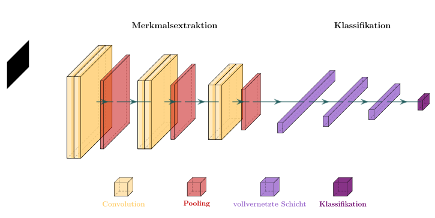
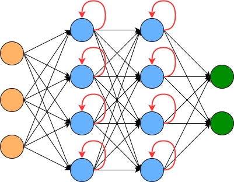
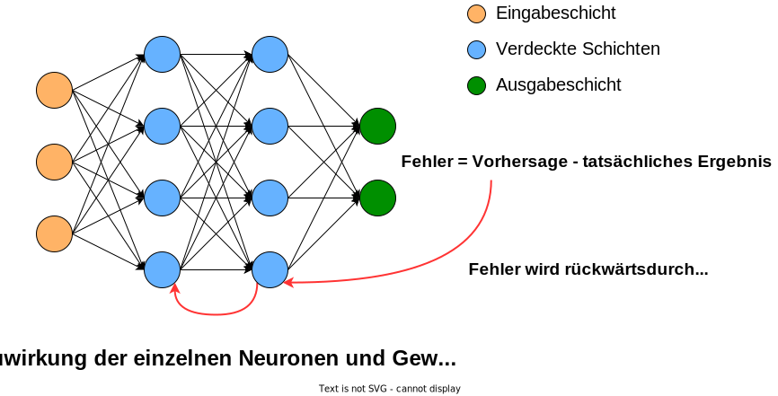
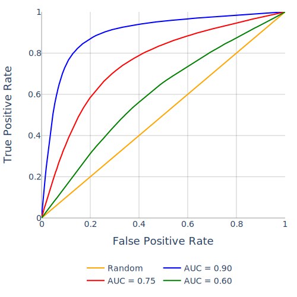
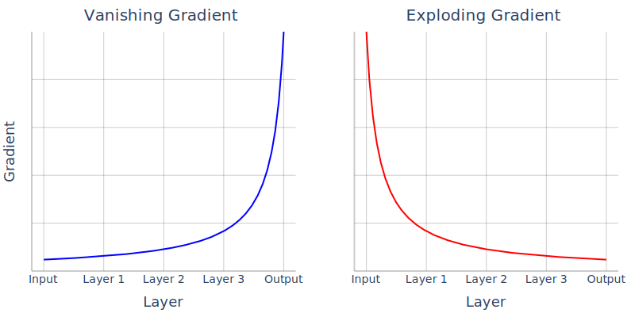
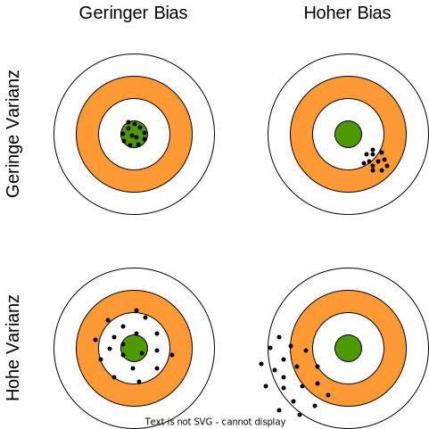

# 1.7 Neuronale Netze

In diesem Kapitel werden die Grundlagen neuronaler Netze und des tiefen Lernens behandelt. Das Ziel ist es, eine klare und einfache Einführung in diese Themen zu bieten, damit zum einen ein Verständnis für die Themen entwickelt wird und dieses in eigenen Projekten angewendet werden kann. Neuronale Netze sind eine Art von Computeralgorithmen, die von der Funktionsweise des menschlichen Gehirns inspiriert sind. Sie bestehen aus künstlichen Neuronen, die Informationen verarbeiten. Das grundlegende Konzept ist, Daten durch diese Neuronen fließen zu lassen, um komplexe Aufgaben wie Mustererkennung, Klassifikation und Vorhersage zu lösen.

<figure><figcaption>
Abbildung 19: Aufbau eines Neuronalen Netzes
</figcaption></figure>

Jedes Neuron erhält Eingaben, multipliziert sie mit Gewichten, durchläuft eine Aktivierungsfunktion und gibt die Ausgabe an andere Neuronen weiter. Während des Trainings passen sich die Gewichtungen an, um Muster in den Daten zu lernen. Durch Feedforward und Backpropagation werden Vorhersagen verbessert und Fehler minimiert. Aktivierungsfunktionen bringen nichtlinearität ins Netzwerk, um komplexe Beziehungen zu erfassen. Insgesamt arbeiten neuronale Netze durch das Zusammenspiel von Neuronen, Gewichten und Aktivierungsfunktionen, um Muster zu lernen und präzise Vorhersagen zu treffen.

[Quelle/weitere Infos](https://aws.amazon.com/de/what-is/neural-network/), [Quelle/weitere Infos 2](https://www.ibm.com/topics/neural-networks), [Quelle/weitere Infos 3](https://www.youtube.com/watch?v=aircAruvnKk)

#### 1.7.2 **Modellarchitekturen**

Die Wahl der richtigen Modellarchitektur ist von großer Bedeutung, da sie darüber entscheidet, wie ein neuronales Netz funktioniert und welche Aufgaben es am besten bewältigen kann. Im Folgenden werden die grundlegendsten verschiedenen Architekturen betrachtet:

**Multilayer Perceptron (MLP)**

Das Multilayer Perceptron (MLP) ist eine klassische Form eines künstlichen neuronalen Netzwerks mit mehreren Schichten. Es besteht aus einer Eingabeschicht, einer oder mehreren versteckten Schichten und einer Ausgabeschicht. Das MLP verwendet Feedforward-Verbindungen, bei denen die Daten nur in eine Richtung fließen, von der Eingabeschicht durch die versteckten Schichten bis zur Ausgabeschicht.

**Vorteile:**

* **Flexibilität:** MLPs sind äußerst flexibel und können für eine Vielzahl von Aufgaben eingesetzt werden, von einfachen Klassifikations- und Regressionsproblemen bis hin zu komplexen Anwendungen wie Sprachverarbeitung und Bilderkennung.
* **Universal Function Approximators:** MLPs gelten als universelle Funktionsapproximatoren, was bedeutet, dass sie in der Lage sind, eine breite Palette von Funktionen zu approximieren, vorausgesetzt ausreichend Trainingdaten und passende Hyperparameter.
* **Skalierbarkeit:** MLPs können durch Hinzufügen weiterer versteckter Schichten und Neuronen pro Schicht erweitert werden, um komplexere Probleme zu bewältigen.

**Nachteile:**

* **Overfitting:** Wie viele komplexe Modelle sind MLPs anfällig für Overfitting, insbesondere wenn sie auf Daten mit begrenzter Größe trainiert werden oder wenn die Modellkomplexität zu hoch ist.
* **Rechenaufwand:** Das Training eines MLPs kann rechenaufwändig sein, insbesondere bei großen Datensätzen oder komplexen Netzwerkarchitekturen.
* **Hyperparameter-Tuning:** Die Auswahl und Optimierung der Hyperparameter eines MLPs kann eine Herausforderung darstellen und erfordert oft experimentelles Tuning, um die optimale Leistung zu erzielen.

**CNN (Convolutional Neural Network)**

Convolutional Neural Networks (CNNs) sind spezialisierte neuronale Netzwerke, die besonders effektiv in der Verarbeitung von Bild- und Mustererkennungsaufgaben sind. Ihr Aufbau beinhaltet typischerweise Convolutional Layers zur lokalen Mustererkennung, Pooling Layers zur Dimensionalitätsreduktion und vollvernetzte Schichten für die Klassifizierung. Bei der Verwendung von CNNs ist es wichtig, die richtige Filtergröße und -anzahl zu wählen, um relevante Merkmale zu extrahieren. Zusätzlich sollte auf Überanpassung geachtet werden, indem Dropout oder Regularisierungstechniken angewendet werden.

**Pooling:**

Pooling reduziert die Dimensionen von Feature-Maps durch Aggregation in kleinen Fenstern.

* **Dimensionsreduktion:** Durch das Beibehalten relevanter Informationen werden Berechnungen effizienter.
* **Invarianz gegenüber Translation:** Die gelernten Merkmale bleiben unabhängig von der Position im Bild erhalten.
* **Effiziente Berechnungen:** Beschleunigt die Berechnungen in nachfolgenden Netzwerkschichten.
* **Overfitting-Reduktion:** Trägt dazu bei, Overfitting zu verhindern, indem eine kompaktere Repräsentation geschaffen wird.

<figure><figcaption>
Abbildung 20: Architektur eines CNNs
</figcaption></figure>

**Vorteile:**

* Bildverarbeitung: CNNs sind hervorragend für Bildverarbeitungsaufgaben geeignet. Es können Merkmale in Bildern extrahiert und räumliche Beziehungen erkannt werden.
* Effizienz: Durch Pooling-Schichten reduzieren sie die Dimensionen, was zu effizienten Berechnungen führt.

**Nachteile:**

* Eingeschränkte Anwendung: CNNs sind spezialisiert auf Bildverarbeitungsaufgaben und weniger geeignet für Text.
* Rechenintensität: Die Anwendung von CNNs erfordert oft leistungsstarke Hardware, insbesondere beim Training großer Modelle oder bei der Verarbeitung hochauflösender Bilder.

**Generative Adversarial Networks (GANs)**

Generative Adversarial Networks (GANs) sind eine neuartige Architektur von neuronalen Netzwerken, die aus einem Generator- und einem Diskriminator-Modell besteht, die miteinander in einem Wettbewerb stehen. Der Generator versucht, Daten zu generieren, die von echten Daten kaum zu unterscheiden sind, während der Diskriminator versucht, zwischen echten und generierten Daten zu unterscheiden.

**Vorteile:**

* **Generative Fähigkeiten:** GANs sind in der Lage, realistisch aussehende Daten zu generieren, die oft kaum von echten Daten zu unterscheiden sind. Dies macht sie ideal für die Generierung von Bildern, Musik und anderen kreativen Inhalten.
* **Unüberwachtes Lernen:** GANs erlernen die Verteilung der Daten ohne explizite Annotationen, was bedeutet, dass sie in der Lage sind, aus nicht gelabelten Daten zu lernen und realistische Beispiele zu erzeugen.
* **Verbesserte Generierung mit Training:** Durch das iterative Training von Generator und Diskriminator verbessert sich die Qualität der generierten Daten im Laufe der Zeit.

**Nachteile:**

* **Training Instabilität:** Das Training von GANs kann instabil sein und zu Modellen führen, die nicht konvergieren oder von Mode Collapse betroffen sind, bei dem der Generator nur eine begrenzte Vielfalt an Daten erzeugt.
* **Auswahl von Hyperparametern:** Die Auswahl und Optimierung der Hyperparameter von GANs kann schwierig sein und erfordert oft experimentelles Tuning, um die optimale Leistung zu erzielen.
* **Mode Collapse:** Dies tritt auf, wenn der Generator nur eine begrenzte Vielfalt an Daten erzeugt und nicht die gesamte Verteilung der Daten abdeckt.

**RNN (Recurrent Neural Network)**:

Recurrent Neural Networks (RNNs) sind neuronale Netzwerke, die für die Verarbeitung von sequenziellen Daten konzipiert sind, wie Zeitreihen oder natürliche Sprache. Ihr Aufbau umfasst Schichten mit wiederkehrenden Neuronen, die Informationen über vorherige Zustände beibehalten können. Diese Fähigkeit ermöglicht es RNNs, zeitliche Abhängigkeiten zu modellieren.

**Vorteile:**

* Sequenzielle Daten: RNNs sind ideal für die Verarbeitung sequenzieller Daten, wie Text und Zeitreihen, da sie Informationen aus vorherigen Zeitschritten speichern können.
* Sprachmodelle: Sie sind unverzichtbar für Aufgaben wie Sprachmodellierung und maschinelles Übersetzen.
* Flexibilität in der Eingabe- und Ausgabegröße: RNNs können Sequenzen unterschiedlicher Längen verarbeiten, was in Anwendungen mit variabler Eingabe- oder Ausgabegröße von Vorteil ist.

**Nachteile:**

* Langzeitabhängigkeiten: RNNs haben Schwierigkeiten, lange Abhängigkeiten zwischen Daten zu erfassen, was als "Vanishing Gradient" -Problem bekannt ist.
* Begrenzte Parallelisierungsmöglichkeiten: RNNs haben aufgrund ihrer sequenziellen Natur begrenzte Möglichkeiten zur Parallelisierung während des Trainings, was zu längeren Trainingszeiten führen kann.

<figure><figcaption>
Abbildung 21: Funktionsprinzip eines RNNs
</figcaption></figure>

**Transformer**:

Transformer ermöglichen die effiziente Verarbeitung von Sequenzen, indem sie relevante Informationen in den Daten priorisieren und unwichtige ignorieren, um Daten besser zu verstehen. Dies erreichen sie durch sogenannte self-attention Mechanismen, die es ermöglichen, effizient langfristige Abhängigkeiten in Daten zu modellieren. Es hilft dem Modell, Zusammenhänge zwischen Wörtern in einem Satz oder zwischen Elementen in einer Datenreihe effektiver zu erfassen. Die Architektur verzichtet auf rekurrente Schichten und ermöglicht somit eine parallele Verarbeitung von Sequenzdaten. Sie werden in Aufgaben des Natural Language Processing (NLP) eingesetzt, wie maschinelles Übersetzen, Textgenerierung und Sentimentanalyse. Ein Beispiel für die Anwendung von Transformers ist das GPT-3 (Generative Pre-trained Transformer 3), ein fortschrittliches Language Model (LLM5) im Bereich des maschinellen Lernens. Es wird insbesondere für Natural Language Processing-Aufgaben wie Textgenerierung und -verständnis eingesetzt. Transformer finden auch Anwendung in Bildverarbeitungsaufgaben, wie Bildklassifikation und Segmentierung.

**Vorteile:**

* Aufmerksamkeitsmechanismus: Transformer verwenden Aufmerksamkeitsmechanismen, um Muster über größere Entfernungen zu erkennen, was sie effektiv für Übersetzungs- und Textverarbeitungsaufgaben macht.
* Parallelisierbarkeit: Sie sind stark parallelisierbar, was die Trainingszeit verkürzt.

**Nachteile:**

* Hohe Anforderungen an Datenmengen: Transformers erfordern oft große Mengen an Trainingsdaten und sind möglicherweise nicht für kleinere Datensätze geeignet.
* Rechenintensität: Die Trainingseffizienz von Transformers erfordert oft leistungsstarke Hardware, insbesondere bei der Verwendung großer Modelle und Datenmengen.

[Quelle/weitere Infos](https://www.v7labs.com/blog/neural-network-architectures-guide)

**1.7.3** **Aktivierungsfunktionen**

Aktivierungsfunktionen sind mathematische Operationen in neuronalen Netzwerken, die auf die gewichtete Summe der Eingaben eines Neurons angewendet werden. Sie verleihen dem Netzwerk nichtlinearität und ermöglichen es, komplexe Zusammenhänge in den Daten zu modellieren. Hier sind einige Fakten zu den Aktivierungsfunktionen in Neuronalen Netzen:

* Gängige Aktivierungsfunktionen umfassen die Sigmoid-Funktion, die Hyperbolic Tangent-Funktion (Tanh) und die Rectified Linear Unit-Funktion (ReLU). Diese Funktionen bestimmen, ob ein Neuron aktiviert wird und inwiefern es zur Berechnung der Ausgabe des Netzwerks beiträgt.
* Die Aktivierung oder Hemmung der Neuronen spielt eine Schlüsselrolle bei der Entscheidungsfindung in neuronalen Netzwerken und ermöglicht es, komplexe Muster und Beziehungen in den Daten zu modellieren.
* Aktivierungsfunktionen sind auch entscheidend, um das "Vanishing Gradient-Problem" in tiefen Netzwerken zu überwinden. Sie bieten eine nichtlineare, aber leicht ableitbare Aktivierungsfunktion, die das Training solcher Netzwerke ermöglicht.
* Die Wahl der richtigen Aktivierungsfunktion hängt von der spezifischen Aufgabe und den Herausforderungen ab. Je nach Aufgabe kann eine unterschiedliche Aktivierungsfunktion erforderlich sein, um die bestmöglichen Ergebnisse zu erzielen.

<figure><figcaption>
Abbildung 23: Verschiedene Aktivierungsfunktionen Neuronaler Netze
</figcaption></figure>

Die visuelle Darstellung von Aktivierungsfunktionen wird dargestellt, indem die x-Achse die Eingabe repräsentiert und die y-Achse den Ausgabewert der Aktivierungsfunktion darstellt. Dies ermöglicht es, die Nichtlinearität und Form der Funktion zu veranschaulichen. Hier werden die häufigsten Aktivierungsfunktionen genauer betrachten, wann sie verwendet werden sollten und ihre Stärken und Schwächen aufgezeigt:

*   **Sigmoid-Aktivierungsfunktion:**

    Die Sigmoid-Funktion wird oft in Output-Schichten für binäre Klassifikation verwendet, da sie Werte zwischen 0 und 1 erzeugt.

    * Vorteile: Die Ableitung der Sigmoid-Funktion ist glatt und einfach zu berechnen. Dies erleichtert das Anpassen der Gewichtungen während des Trainings mithilfe von Gradientenabstiegsverfahren.
    * Nachteile: Bei tiefen Netzwerken kann das [**Vanishing Gradient-Problem**](https://www.kdnuggets.com/2022/02/vanishing-gradient-problem.html) auftreten, was die Konvergenz verlangsamen und das Training erschweren kann. Das Vanishing Gradient-Problem tritt auf, wenn die Ableitung der Sigmoid-Funktion in den tieferen Schichten des Netzes sehr klein wird, was zu einem Verschwinden des Gradienten und damit zu langsameren Lernraten führt. Dies kann die Effizienz des Trainingsprozesses erheblich beeinträchtigen.
*   **ReLU (Rectified Linear Unit)-Aktivierungsfunktion:**

    ReLU ist eine der am häufigsten verwendeten Aktivierungsfunktionen und ist für viele Aufgaben geeignet.

    * Vorteile\*:\* Im Vergleich zu Sigmoid oder Tanh hilft die ReLU-Funktion, das Problem des verschwindenden Gradienten zu mildern. Die Ableitung ist für positive Werte immer 1, was zu stabileren Gradienten bei der Rückwärtspropagation führt.
    * Nachteile\*:\* Neuronen mit negativen Eingaben bleiben inaktiv (geben den Wert Null aus), was zu sogenannten "Dead Neurons" führen kann. Dieses Problem kann dazu führen, dass bestimmte Neuronen während des Trainings nicht mehr aktiviert werden und keine Gewichtsaktualisierungen erfahren.
*   **Tanh-Aktivierungsfunktion:**

    Tanh eignet sich gut für Aufgaben mit Daten, deren Mittelwert nahe bei 0 liegt, wie bei Bildern.

    * Vorteile\*:\* Die tanh-Funktion gibt Werte zwischen -1 und 1 aus, was im Vergleich zu ReLU zentriert um Null ist. Dies kann dazu beitragen, das Problem der langsam konvergierenden Netzwerke zu mildern, das bei ReLU auftreten kann.
    * Nachteile: Ähnlich wie bei Sigmoid kann die tanh-Funktion das Problem des verschwindenden Gradienten (vanishing gradient) in tiefen Netzwerken verursachen. Dies kann das Training erschweren, insbesondere wenn das Netzwerk viele Schichten hat.
*   **Softmax-Aktivierungsfunktion:**

    Die Softmax-Funktion wird in Multi-Class-Klassifikationsaufgaben als Ausgabeschicht verwendet.

    * Vorteile: Die Ableitung der Softmax-Funktion kann relativ einfach berechnet werden, was sie für Gradientenabstiegsverfahren und das Training von neuronalen Netzwerken geeignet macht.
    * Schwächen: Die Softmax-Aktivierungsfunktion kann dazu neigen, den Unterschied zwischen großen Eingabewerten zu verstärken, was als "Exploding Gradient" bezeichnet wird.

[Quelle/weitere Infos](https://www.geeksforgeeks.org/activation-functions-neural-networks/), [Quelle/weitere Infos 2](https://www.datacamp.com/tutorial/introduction-to-activation-functions-in-neural-networks), [Quelle/weitere Infos 3](https://www.v7labs.com/blog/neural-networks-activation-functions)

### 1.8 Training Neuronaler Netze - **Workflow**

Das Modelltraining ist ein weiterer entscheidender Schritt in der Entwicklung von (Tiny)ML-Modellen. In diesem Kapitel wird das Modelltraining umfassend behandelt, sowohl in der Theorie als auch in der praktischen Implementierung. Es wird auf verschiedene Aspekte eingegangen, von der Modellauswahl, über die einzelnen Schritte des Modelltrainings bis hin zur Modelloptimierung.

<figure><figcaption>
Abbildung 24: Workflow des trainierens Neuronaler Netze
</figcaption></figure>

#### 1.8.1 **Modellauswahl**

Bei der Entscheidung für ein Machine Learning-Modell stehen verschiedene Ansätze zur Auswahl. Neben der Entwicklung eines eigenen Modells, sind die Methoden Fine-Tuning oder Feature Extraction alternative Vorgehensweisen. Im Folgenden werden die Vor- und Nachteile dieser Ansätze Lernens näher erläutert.

<figure><figcaption>
Abbildung 25: Workflow des trainierens Neuronaler Netze (Modellauswahl)
</figcaption></figure>

**Eigenes Modell**

Bei der Entwicklung eines eigenen Modells, wird dieses von Grund auf für eine spezifische Aufgabe trainiert. In diesem Ansatz werden die Hyperparameter und Architektur des Modells auf diese Aufgabe abgestimmt. Hier sind einige Vor- und Nachteile:

Vorteile:

* Anpassung an spezifische Anforderungen: Ein maßgeschneidertes Modell kann optimal auf die spezifischen Anforderungen der Aufgabe zugeschnitten werden, was möglicherweise zu besserer Leistung führt.
* Kontrolle: Die Entwickler haben volle Kontrolle über die Modellarchitektur, Hyperparameter und Trainingsprozess, was es ermöglicht, das Modell genau nach den eigenen Anforderungen zu gestalten.

Nachteile:

* Benötigt mehr Daten: Die Entwicklung eines eigenen Modells erfordert oft eine größere Menge an Trainingsdaten im Vergleich zu Finetuning oder Transfer Learning.
* Zeit- und Ressourcenintensiver: Das Training eines Modells von Grund auf kann zeitaufwändiger sein und mehr Rechenressourcen erfordern, da während des Trainings die Modellgewichte von ihren initialen Startwerten an die Merkmale und Muster in den Daten angepasst werden müssen.

**Transfer Learning:**

Transfer Learning ist ein übergeordneter Ansatz, der die Nutzung eines vortrainierten Modells für eine neue Aufgabe ermöglicht. Dabei wird das bereits trainierte Modell als Ausgangspunkt verwendet, um die Leistungsfähigkeit auf einer neuen, verwandten Aufgabe zu verbessern.

* **Feature Extraction:**
  * In dieser Methode wird das vortrainierte Modell als Feature-Extraktor genutzt, um relevante Merkmale aus den Daten zu extrahieren
  * Diese Merkmale dienen dann als Eingabe für ein neues Modell, das spezifisch für die neue Aufgabe ist.
* **Fine-Tuning:**
  * ist eine spezifische Form des Transfer Learning
  * Methode zur Verfeinerung der Leistung eines Modells durch Anpassung seiner Gewichtungen an die Anforderungen einer spezifischen Aufgabe
  * Hierbei wird das vortrainierte Modell angepasst, indem einige oder alle seiner Schichten trainiert werden, um es besser an die neue Aufgabe anzupassen.
  * Typischerweise werden die oberen Schichten des Modells für die neue Aufgabe feinabgestimmt, während die unteren Schichten in der Regel beibehalten werden.
* **Unterschiede zwischen Feature Extraction und Fine-Tuning:**
  * Feature Extraction konzentriert sich darauf, nur die letzten Schicht(en) des vortrainierten Modells anzupassen, während Fine-Tuning eine Anpassung der letzten x Schichten ermöglicht, wobei x eine variable Anzahl sein kann.
  * Während bei der Feature Extraction die bereits trainierten Gewichte der meisten Schichten unverändert bleiben, ermöglicht das Fine-Tuning eine größere Anpassung der Gewichte, was zu einer potenziell besseren Anpassung an die neue Aufgabe führen kann.
  * Die Unterschiede zwischen den beiden Methoden können je nach der Komplexität der neuen Aufgabe und der Ähnlichkeit der Daten variieren, aber generell bieten beide Ansätze Möglichkeiten zur Leistungsverbesserung beim Transfer Learning.

**Vorteile:**

* Finetuning und Transfer Learning sind besonders nützlich, wenn Sie nicht über ausreichend Daten für das Training eines Modells von Grund auf verfügen. Sie sparen Zeit und Ressourcen.
* Sie beschleunigen das Modelltraining, verbessern die Modellleistung und sind ressourceneffizient.

**Nachteile:**

* Für einige spezialisierte Aufgaben sind vortrainierte Modelle möglicherweise nicht optimal. Außerdem sind sie sind meistens relativ groß, obwohl das nicht für jede Aufgabe notwendig ist.

Durch die Kombination von Feature Extraction und Fine-Tuning unter dem Dach des Transfer Learning können wir vortrainierte Modelle effektiv nutzen, um die Leistung in neuen Aufgabenbereichen zu verbessern. Ein Beispiel dafür wäre die Anwendung eines vortrainierten Bildklassifizierungsmodells wie VGG16 auf eine spezifische Klassifizierungsaufgabe wie die Unterscheidung zwischen verschiedenen Hunderassen. Hierbei könnten sowohl Feature Extraction als auch Fine-Tuning verwendet werden, um die Modellleistung zu optimieren.

[DEV/Understanding the Differences: Fine-Tuning vs. Transfer Learning](https://dev.to/luxacademy/understanding-the-differences-fine-tuning-vs-transfer-learning-370)

[https://www.tensorflow.org/tutorials/images/transfer\_learning](https://www.tensorflow.org/tutorials/images/transfer\_learning)

#### 1.8.2 **Modelltraining**

Beim Trainieren eines Neuronalen Netzes, werden nacheinander einige Schritte durchlaufen. Dazu gehört: Definierung von Hyperparametern, Vorwärtspropagation, Fehlerberechnung, Rückpropagation, Optimierungsschritt, Modellvalidierung und das Earlystopping. Im Folgenden werden diese Schritte näher erläutert.

<figure><figcaption>
Abbildung 26: Workflow des trainierens Neuronaler Netze (Modelltraining)
</figcaption></figure>

**Hyperparameter definieren**

Die Konfiguration der Hyperparameter, wie bspw. die Lernrate oder die Anzahl der Epochen, die das Modell trainiert werden soll, spielen eine entscheidende Rolle im Modelltraining. Diese Parameter beeinflussen, wie gut und schnell das Modell lernt und wie gut es gegen Überanpassung abgesichert ist. Daher sollten Hyperparameter sorgfältig ausgewählt werden, um das Training effizient zu gestalten, wie bspw.:

* **Lernrate (Learning Rate):** Die Lernrate ist ein entscheidender Hyperparameter, der die Schrittgröße angibt, mit der die Gewichte im Neuronalen Netz angepasst werden. Eine zu hohe Lernrate kann zu Konvergenzproblemen führen, da das globale Optimum durch zu große Sprünge “übersprungen” wird. Eine zu niedrige Lernrate verlangsamt dahingegen das Training und außerdem kann es sein, dass nur ein lokales Optimum gefunden wird aufgrund zu kleiner Sprünge.
* **Anzahl der Epochen:** Die Anzahl der Epochen gibt an, wie oft das gesamte Trainingsdatenset durch das Netzwerk geht. Zu viele Epochen können zu Overfitting führen, während zu wenige zu Underfitting führen können.
* **Anzahl der Schichten und Neuronen pro Schicht:** Die Architektur des neuronalen Netzwerks ist wichtig. Mehr Schichten und Neuronen können die Lernfähigkeit erhöhen, aber auch zu Overfitting führen.
* **Batch Size:** Die Batch Size gibt an, wie viele Datenpunkte gleichzeitig zur Aktualisierung der Gewichtungen verwendet werden. Kleine Batch Sizes können zu mehr Instabilität im Training führen, während große Batch Sizes den Speicherbedarf erhöhen. Die Wahl der Batch Size hängt von den verfügbaren Ressourcen und der Aufgabe ab.

**Modelltraining Schritte**

**1. Vorwärtspropagierung:** Die Vorwärtspropagierung ist der erste Schritt im Trainingsprozess. Hier werden die Eingabedaten durch das neuronale Netz geleitet. In jeder Schicht des Netzes werden die Aktivierungsfunktionen unter Verwendung der Gewichte und des Bias angewendet, um die Modellausgaben zu berechnen. Die Gewichte repräsentieren die Stärke der Verbindungen zwischen den Neuronen, während der Bias einen Offset darstellt, der die Ausgaben beeinflusst und dazu beiträgt, nichtlineare Muster in den Daten zu erfassen.

**2. Lossfunktion:** Die Lossfunktion ist von zentraler Bedeutung, da sie den Fehler zwischen den Modellausgaben und den tatsächlichen Daten misst. Für unterschiedliche Aufgaben werden unterschiedliche Lossfunktionen verwendet. Die Gewichte und der Bias in den Schichten beeinflussen direkt den Wert der Lossfunktion. Anhand des ermittelten Fehlers zwischen Modellausgabe und erwarteter Ausgabe werden wiederum die Gewichte und Bias des Modells angepasst.

Die Auswahl der richtigen Lossfunktion hängt von der Art der Aufgabe ab. Einige Beispiele sind:

* **Mean Squared Error (MSE):** Geeignet für Regressionsprobleme, bei denen Vorhersagen numerische Werte sind.
* **Categorical Crossentropy:** Für Klassifikationsprobleme mit mehreren Klassen, bei denen die Ausgaben in Wahrscheinlichkeiten für jede Klasse umgewandelt werden.
* **Binary Crossentropy:** Für binäre Klassifikationsprobleme, bei denen die Ausgaben Wahrscheinlichkeiten für zwei Klassen sind.

Die geeignete Lossfunktion ist entscheidend für die Anpassung des Modells an die spezifische Aufgabe und ermöglicht eine gute Bewertung der Leistung. Eine nicht passende Lossfunktion kann zu einer ungenauen Modellbewertung führen und das Training beeinträchtigen.

**3. Backpropagation** Die Backpropagation ist der Kern des Trainingsprozesses. In diesem Prozess wird der Fehler, der durch die Lossfunktion ermittelt wurde, durch das Netzwerk zurückverfolgt. Dabei werden die Ableitungen der Lossfunktion in Bezug auf die Gewichte und den Bias berechnet. Dieser Schritt ermöglicht es dem Modell, Fehler in den Gewichten und dem Bias zu erkennen und anzupassen, um die Leistung des Netzwerks zu verbessern. Im folgenden Abschnitt wird das Vorgehen der Backpropagation genauer beschrieben:

<figure><figcaption>
Abbildung 27: Funtionsweise der Backpropagation
</figcaption></figure>

1. **Fehlerpropagation:** Backpropagation ist ein grundlegender Algorithmus im maschinellen Lernen und in neuronalen Netzen. Der Name des Algorithmus beschreibt die Vorgehensweise: Der Fehler wird rückwärts durch das Netzwerk propagiert. Dieser Prozess beginnt an der Ausgabeschicht des Netzwerks und bewegt sich schrittweise zurück zu den Eingangsneuronen.&#x20;
2. **Gradientenberechnung:** Während die Fehler rückwärts durch das Netz propagiert werden, werden die Gradienten der Lossfunktion in Bezug auf die Gewichtungen und den Bias berechnet. Dies geschieht mithilfe der Kettenregel, die es ermöglicht, die Auswirkungen von Gewichtungen in einer Schicht auf den Fehler in der vorherigen Schicht zu ermitteln. Das Gradientenabstiegsverfahren spielt hier eine entscheidende Rolle, da es die Berechnung und Aktualisierung der Gradienten ermöglicht. [Artemoppermann/Backpropagation: Training der neuronalen Netze](https://artemoppermann.com/de/training-der-kuenstlichen-neuronalen-netze/)
3. **Gewichtsanpassung:** Der ermittelte Gradient der Lossfunktion wird verwendet, um die Gewichtungen im neuronalen Netzwerk schrittweise anzupassen. Das Gradientenabstiegsverfahren wird eingesetzt, um die Gewichtungen entlang des Gradienten zu aktualisieren. Dies bewirkt eine schrittweise Minimierung der Lossfunktion.
4. **Iterative Wiederholung:** Die Schritte 1 bis 3 werden iterativ wiederholt, um das Neuronale Netz zu trainieren. Während des Trainingsprozesses wird der Fehler nach und nach reduziert, und das Modell passt sich den Daten an.

**4. Optimierungsschritt** Der Optimierungsschritt bezieht sich darauf, wie die Gradienten der Lossfunktion verwendet werden, um die Gewichte und Bias des Modells anzupassen. Dies wird normalerweise mit einem Optimierungsalgorithmus wie dem Gradientenabstiegsverfahren durchgeführt, der die Gewichte schrittweise entlang des Gradienten der Lossfunktion aktualisiert. Die Wahl des Optimierungsalgorithmus und seiner Parameter beeinflusst die Effizienz und Konvergenzgeschwindigkeit des Trainingsprozesses. Es gibt verschiedene Optimierungsalgorithmen, darunter:

* **Stochastic Gradient Descent (SGD):** Ein grundlegender Optimierer, der die Gewichte nach jedem Datenpunkt aktualisiert. Er ermöglicht ein effizientes Training von Modellen auf großen Datensätzen. Allerdings kann er zu unregelmäßigen Aktualisierungen führen, was die Konvergenz beeinträchtigen kann.
* **Adam (Adaptive Moment Estimation):** Ein adaptiver Optimierer, der die Lernrate für jedes Gewicht individuell anpasst. Er ist effektiv in vielen Anwendungen und gegenüber der Lernratenwahl robuster, allerdings könnte in manchen Fällen der erhöhte Rechenaufwand ein Problem darstellen.
* **Mini-Batch Gradientenabstieg:** Beim Mini-Batch-Gradientenabstieg werden die Daten in kleine, zufällig ausgewählte Mini-Batches unterteilt. Dies ermöglicht eine effiziente Nutzung von Rechenressourcen und beschleunigt die Konvergenz im Vergleich zum SGD. Die Mini-Batch-Größe ist ein wichtiger Hyperparameter, der sorgfältig ausgewählt werden muss, da er die Stabilität und Geschwindigkeit des Trainings beeinflusst.
* **RMSprop (Root Mean Square Propagation):** Ein weiterer adaptiver Optimierer, der adaptive Lernraten durch die Berechnung von gleitenden Durchschnitten der quadrierten Gradienten verwendet. RMSprop kann die Lernrate automatisch selbst anpassen.

Die Wahl des Optimierers hängt von der spezifischen Aufgabe und den Daten ab. Adam ist oft ein guter Ausgangspunkt und für viele Anwendungen geeignet. Optimierer helfen, das Modell effizienter zu trainieren, indem sie die Gewichtungen anpassen, um die Lossfunktion zu minimieren. Die falsche Wahl des Optimierers kann das Training verlangsamen oder zu Konvergenzproblemen führen.

Der Optimierer ist ein wichtiger Bestandteil des Modelltrainings. Er ist verantwortlich für die Aktualisierung der Gewichtungen im Netz während des Gradientenabstiegsverfahrens.

Eine weitere Möglichkeit die Performance eines Modells während des Trainingsprozesses zu bewerten, ist die Kreuzvalidierung.

**Modellvalidierung**

Modellvalidierung ist ein wesentlicher Schritt im Prozess des Modelltrainings, um sicherzustellen, dass das zu trainierende Modell tatsächlich die gewünschten Vorhersagen oder Klassifizierungen auf neuen, bisher ungesehenen Daten treffen kann. Dieser Schritt findet am Ende einer Epoche des Trainings statt, um die Generalisierungsfähigkeit des Modells zu überprüfen und Überanpassung zu erkennen und zu verhindern. Dabei kann zwischen der einfachen Validierung mit einem separaten Validierungsdatensatz und der Kreuzvalidierung als alternative Methode unterschieden werden.

**Validierung mit Validierungsdatensatz**

Bei dieser Validierungsmethode wird ein separater Validierungsdatensatz verwendet, der nicht Teil des Trainingsdatensatzes ist. Diese Methode ist einfach und schnell durchzuführen, erfordert jedoch, dass ein ausreichend großer und repräsentativer Validierungsdatensatz vorhanden ist. Es ist wichtig sicherzustellen, dass der Validierungsdatensatz keine Daten enthält, die bereits im Trainingsdatensatz enthalten sind, um eine objektive Bewertung der Modellleistung zu gewährleisten.

**Kreuzvalidierung (Cross-Validation)**

Kreuzvalidierung ist eine wichtige Technik, um die Robustheit und die Fähigkeit des Modells zur Generalisierung sicherzustellen. In diesem Abschnitt werden die Konzepte der k-fachen Kreuzvalidierung und Leave-One-Out-Kreuzvalidierung beschrieben:

* **k-fache Kreuzvalidierung:** Bei dieser Methode wird der Datensatz in k gleich große Teilmengen aufgeteilt. Das Modell wird k-mal trainiert und getestet, wobei in jedem Durchgang eine der Teilmengen als Validierungsdatensatz dient und die übrigen k-1 Teilmengen für das Training verwendet werden. Dies hilft, die Modellleistung unter verschiedenen Datenaufteilungen und letztlich die Generalisierung des Modells zu bewerten.
* **Leave-One-Out-Kreuzvalidierung:** Bei dieser Methode wird für jeden Datenpunkt im Datensatz ein einzelnes Trainingsset erstellt, während der entsprechende Datenpunkt als Validierungsdatensatz verwendet wird. Dies bedeutet, dass für einen Datensatz mit N Beobachtungen N Iterationen durchgeführt werden. Das Modell wird in jedem Durchlauf mit N-1 Datenpunkten trainiert und mit dem ausgeschlossenen Datenpunkt validiert. Dies ermöglicht eine sehr detaillierte Bewertung, ist jedoch sehr rechenintensiv.

**Early Stopping (Frühzeitiges Stoppen)**

Early Stopping ist eine einfache, aber effektive Methode, um Überanpassung während des Modelltrainings zu verhindern. Der Ansatz besteht darin, das Training abzubrechen, sobald die Leistung (auf einem Validierungsdatensatz) nicht mehr verbessert wird. Hier sind die Schlüsselaspekte des frühzeitigen Stoppens:

* **Zweck:** Das Ziel des frühzeitigen Stoppens besteht darin, Überanpassung zu verhindern und die Modellkomplexität zu steuern.
* **Verwendung:** Während des Trainingsprozesses wird regelmäßig die Leistung (auf einem separaten Validierungsdatensatz) überwacht. Wenn sich die Leistung nicht mehr verbessert oder sogar verschlechtert, wird das Training abgebrochen.
* **Vorteile:** verkürzt die Trainingszeit und vermeidet eine zu starke Anpassung an die Trainingsdaten.
* **Nachteil:** In einigen Fällen könnte das frühzeitige Stoppen dazu führen, dass das Modell nicht seine maximale Leistungsfähigkeit erreicht, da das Training vorzeitig abgebrochen wird.

**Learning Rate Scheduler (Lernratenplaner)**

Learning Rate Scheduler sind Werkzeuge in der Optimierung von neuronalen Netzen, die dazu dienen, die Lernrate dynamisch während des Trainings anzupassen. Die Lernrate ist ein entscheidender Hyperparameter, der bestimmt, wie groß die Schritte sind, die während des Gradientenabstiegsverfahrens unternommen werden, um die Gewichte des Netzes zu aktualisieren. Ein Learning Rate Scheduler passt die Lernrate basierend auf bestimmten Kriterien oder Zeitpunkten an. Hier sind die Schlüsselaspekte des Learning Rate Schedulers:

* **Zweck:** Das Ziel des Learning Rate Schedulers besteht darin, die Effizienz des Trainingsprozesses zu verbessern und die Modellleistung zu optimieren, indem die Lernrate dynamisch angepasst wird.
* **Verwendung:** Während des Trainingsprozesses wird die Lernrate regelmäßig überwacht und entsprechend den definierten Kriterien oder Zeitpunkten angepasst.
* **Arten von Learning Rate Schedules:** Zu den verschiedenen Arten von Learning Rate Schedules gehören die Konstante Lernrate, der Stufenplan, der exponentielle Abfall, das lineare Abklingen und das Cosinusannealing. Jeder Ansatz hat spezifische Vor- und Nachteile, die je nach den Anforderungen der Aufgabe und der Modellarchitektur berücksichtigt werden müssen.
* **Auswahl:** Es gibt verschiedene Arten von Learning Rate Schedulern. Die Auswahl des geeigneten Learning Rate Schedulers hängt von der spezifischen Aufgabe, der Architektur des Modells und anderen Hyperparametern ab. Ein passender Learning Rate Scheduler kann dazu beitragen, die Konvergenz zu beschleunigen, die Modellleistung zu verbessern und das Risiko von Überanpassung zu verringern.
* **Vorteil:** Verbesserte Konvergenz: Die dynamische Anpassung der Lernrate kann die Konvergenz des Modells beschleunigen, indem sie den Trainingsprozess effizienter gestaltet.
* **Nachteil:** Komplexität: Die Auswahl und Konfiguration eines Learning Rate Schedulers erfordert zusätzliche Überlegungen und kann den Trainingsprozess komplexer machen.

#### 1.8.3 **Modellbewertung**

Die Bewertung von Modellen ist ein entscheidender Schritt im maschinellen Lernen, um sicherzustellen, dass sie ihre Aufgaben effektiv erfüllen. Durch die Analyse verschiedener Metriken können wir die Leistung eines Modells objektiv beurteilen. Diese Metriken ermöglichen es uns, die Genauigkeit, Präzision, Trefferquote und andere Aspekte des Modells zu bewerten. Darüber hinaus müssen wir uns mit Herausforderungen wie dem Exploding und Vanishing Gradient-Problem sowie dem Bias-Variance-Tradeoff auseinandersetzen, um die Robustheit und Effizienz unserer Modelle zu verbessern. In diesem Abschnitt werden wir die wichtigsten Metriken und Herausforderungen bei der Bewertung von Modellen genauer untersuchen.

<figure><figcaption>
Abbildung 28: Workflow des trainierens Neuronaler Netze (Modellbewertung)
</figcaption></figure>

**Metriken**

Die Konfusionsmatrix ist ein grundlegendes Werkzeug zur Bewertung der Leistung eines Klassifikationsmodells. Sie zeigt die Anzahl der richtigen und falschen Vorhersagen des Modells für jede Klasse an. Die Tabelle unterscheidet zwischen vier möglichen Ergebnissen:

1. True Positive (TP): Das Modell hat eine positive Instanz korrekt vorhergesagt.
2. False Positive (FP): Das Modell hat eine negative Instanz fälschlicherweise als positiv vorhergesagt.
3. True Negative (TN): Das Modell hat eine negative Instanz korrekt vorhergesagt.
4. False Negative (FN): Das Modell hat eine positive Instanz fälschlicherweise als negativ vorhergesagt.

Diese Werte sind entscheidend, um verschiedene Leistungsmetriken zu berechnen, darunter Genauigkeit, Präzision, Trefferquote und F1-Score. Anhand der Konfusionsmatrix können wir sehen, wie gut das Modell zwischen den Klassen unterscheidet und ob es dazu neigt, bestimmte Arten von Fehlern zu machen. Sie dient als Grundlage für die Interpretation der Modellleistung und die Identifizierung von Verbesserungsmöglichkeiten.

|                 | Predicted Positive  | Predicted Negative  |
| --------------- | ------------------- | ------------------- |
| Actual Positive | True Positive (TP)  | False Negative (FN) |
| Actual Negative | False Positive (FP) | True Negative (TN)  |

In diesem Abschnitt werden einige Metriken zur Modellbewertung der Klassifikation erläutert:

*   **Accuracy (Genauigkeit):** Die Genauigkeit gibt an, wie viele der Vorhersagen eines Modells korrekt sind. Sie ist die einfachste Metrik und wird oft verwendet, wenn die Klassen im Datensatz ausgeglichen sind. Die Genauigkeit allein reicht jedoch nicht aus, wenn die Klassenverteilung unausgewogen ist, da die Genauigkeit nicht zwischen falsch positiven und falsch negativen Vorhersagen unterscheidet. Beispielsweise ist sie bei einer Bilderkennung hilfreich, um zu zeigen, wie viele Bilder insgesamt korrekt klassifiziert wurden.

    $$Accuracy=\frac{\textcolor{green}{TP}}{\textcolor{green}{TP}+\textcolor{red}{FN}+\textcolor{orange}{FP}+\textcolor{blue}{TN}}$$
*   **Precision (Präzision):** Die Präzision misst, wie viele der als positiv vorhergesagten Instanzen tatsächlich positiv sind. Diese Metrik ist nützlich, wenn falsch positive Vorhersagen vermieden werden sollten. Sie hilft, das Problem von Type-I-Fehlern zu bewerten. Type-I-Fehler beziehen sich auf falsch positive Vorhersagen, bei denen das Modell fälschlicherweise etwas als positiv vorhersagt, obwohl es in Wirklichkeit negativ ist.

    Die Präzision ist besonders relevant in medizinischen Anwendungen, wie der Erkennung von Krankheiten, wenn falsch positive Diagnosen schwerwiegende Konsequenzen haben könnten. Ein höherer Präzisionswert zeigt an, dass die als positiv vorhergesagten Fälle mit hoher Sicherheit auch tatsächlich positiv sind.

    $$Precision=\frac{\textcolor{green}{TP}}{\textcolor{green}{TP}+\textcolor{orange}{FP}}$$
*   **Recall (Trefferquote):** Die Trefferquote misst, wie viele der tatsächlich positiven Instanzen vom Modell erkannt wurden. Sie ist entscheidend in Situationen, in denen es unerwünschte Konsequenzen hat, echte positive Fälle zu übersehen. Sie befasst sich mit Type-II-Fehlern. Type-II-Fehler bezeichnen hingegen falsch negative Vorhersagen, bei denen das Modell etwas als negativ vorhersagt, obwohl es tatsächlich positiv ist.

    Bei Sicherheitsanwendungen, wie der Erkennung von defekten Produkten in einer Produktionslinie, ist der Recall wichtig, um sicherzustellen, dass keine wirklichen Defekte übersehen werden. Ein höherer Recall-Wert deutet darauf hin, dass das Modell mehr der tatsächlich positiven Fälle erkennt.

    $$Recall=\frac{\textcolor{green}{TP}}{\textcolor{green}{TP}+\textcolor{red}{FN}}$$
*   **F1-Score:** Bietet eine ausgewogene Bewertung der Modellleistung und ist besonders hilfreich, wenn Präzision und Recall im Gleichgewicht gehalten werden müssen. Geeignet für Szenarien, in denen ein Kompromiss zwischen falsch positiven und falsch negativen Vorhersagen gefunden werden muss. Der F1-Score ist zum Beispiel bei Betrugserkennung im Finanzbereich relevant. Er berücksichtigt beide Aspekte und hilft, einen ausgewogenen Kompromiss zu finden.

    $$F1-Score=\frac{2PrecisionRecall}{Precision+Recall}$$
*   **AUC-ROC (Area Under the Receiver Operating Characteristic Curve):** Die AUC-ROC-Metrik bewertet die Fähigkeit eines Klassifikationsmodells, zwischen den Klassen zu unterscheiden, indem sie die Fläche unter der ROC-Kurve misst. Eine höhere AUC-ROC zeigt an, dass das Modell besser in der Lage ist, wahre positive und wahre negative Fälle zu unterscheiden. Eine ROC-Kurve (Receiver Operating Characteristic Curve) zeigt die Leistung des Modells über verschiedene Schwellenwerte für die Klassifikation.

    Bei Klassifikationsproblemen, insbesondere in der Medizin, ist die AUC-ROC-Metrik wichtig, um die Fähigkeit des Modells zu bewerten, wahre positive und wahre negative Fälle zu unterscheiden. Dies könnte beispielsweise bei der Evaluierung der diagnostischen Genauigkeit eines Modells relevant sein.                                                             &#x20;

    <figure><figcaption>
Abbildung 29: ROC-Kurve ergibt sich aus dem Verhältnis von “True Positive Rate” zu “False Positive Rate”
</figcaption></figure>

    Eine Kurve, die näher am oberen linken Rand des Diagramms verläuft, deutet auf ein Modell hin, das eine bessere Leistung hat, da es eine höhere TPR bei niedrigerem FPR aufweist. Die Fläche unter dieser Kurve, die AUC-ROC genannt wird, gibt einen Wert zwischen 0 und 1 an, wobei 1 eine perfekte Klassifikation und 0.5 eine zufällige Klassifikation darstellt. Eine höhere AUC-ROC zeigt an, dass das Modell besser in der Lage ist, wahre positive und wahre negative Fälle zu unterscheiden.
*   **Cohen's Kappa (Cohens Kappa):** Cohens Kappa ist eine statistische Metrik, die die Übereinstimmung zwischen den beobachteten und erwarteten Klassifikationen über die Zufallsübereinstimmung hinaus bewertet. Es berücksichtigt, wie gut das Modell im Vergleich zur reinen Zufallsklassifikation abschneidet. Ein höherer Kappa-Wert deutet auf eine bessere Leistung hin, wobei 1 die perfekte Übereinstimmung und 0 die Übereinstimmung durch reines Zufallsgeschehen darstellt.

    Cohens Kappa ist in rechtlichen oder ethischen Anwendungen besonders sinnvoll, wenn die Klassenverteilung unausgewogen ist und eine Zufallsübereinstimmung nicht ausreicht.

Die Anwendung dieser Metriken erfolgt in Verbindung mit einem Testdatensatz, um die Leistung des Modells zu bewerten.

**Herausforderungen**

Im folgenden Kapitel werden die Herausforderungen beim Training wie Exploding und Vanishing Gradients beschrieben. Zusätzlich wird das wichtige Variance-Bias-Tradeoff beleuchtet, um ein tieferes Verständnis für die Feinabstimmung und Robustheit von neuronalen Netzen zu entwickeln.

**Exploding Gradient**

Das Exploding Gradient-Problem kann die Stabilität eines Modells erheblich beeinträchtigen.

* **Gradient Clipping:** Diese Technik begrenzt die Größe der Gradienten während des Trainings, um zu verhindern, dass sie exponentiell anwachsen. Dies ist besonders wichtig in tiefen neuronalen Netzen.
* **Batch Normalization:** Diese Methode normalisiert Aktivierungen in den Schichten, was zur Stabilisierung des Trainingsprozesses und zur Minimierung des Exploding Gradient-Problems beiträgt.
* **Aktivierungsfunktionen und ihr Einfluss:**
  * **Sigmoid und tanh:** Neigen dazu, das Exploding Gradient-Problem zu verstärken, insbesondere in tieferen Schichten.
  * **ReLU (Rectified Linear Unit):** Begrenzt das Problem der zu großen Gradienten, da die Ableitung für positive Eingaben konstant ist.
  * **Leaky ReLU, PReLU und ELU:** Durch spezielle Formen der Nichtlinearität wird das Risiko von explosiven Gradienten reduziert.

**Vanishing Gradient**

Das Vanishing Gradient-Problem beeinträchtigt vor allem die Fähigkeit von tiefen neuronalen Netzwerken, Informationen über lange Sequenzen oder Schichten zu transportieren.

**Aktivierungsfunktionen mit nicht verschwindenden Gradienten:**

* **ReLU (Rectified Linear Unit):** Verhindert das Verschwinden von Gradienten in positiven Bereichen.
* **Leaky ReLU, PReLU und ELU:** Durch ihre speziellen Formen verbessern sie die Robustheit gegenüber dem Vanishing Gradient-Problem.

<figure><figcaption>
Abbildung 30: Verhalten der Gradienten in den jeweiligen Layern beim Vanishing und Exploding Gradient Problem
</figcaption></figure>

**Bias-Variance-Tradeoff**

Das Bias-Variance-Tradeoff ist ein entscheidendes Konzept bei der Modellbewertung und Auswahl.

* **Bias (Verzerrung):** Ein höheres Bias zeigt an, dass das Modell zu einfache Annahmen trifft und sich schlecht an die Trainingsdaten anpasst. (Modell zu klein)
* **Variance (Varianz):** Eine höhere Varianz zeigt an, dass das Modell zu komplex ist und sich zu stark an die Trainingsdaten anpasst. (Modell zu groß)
* **Tradeoff:** Das Ziel ist es, den optimalen Punkt zwischen Bias und Varianz zu finden, um ein Modell zu entwickeln, das sowohl auf den Trainingsdaten als auch auf neuen Daten gut abschneidet.

<figure><figcaption>
Abbildung 31: Schematische Darstellung der Auswirkung von Bias und Varianz
</figcaption></figure>

Die Regularisierungstechniken, in Kombination mit sorgfältig ausgewählten Aktivierungsfunktionen, sind entscheidend, um die Modellleistung zu stabilisieren und zu verbessern. Gleichzeitig ist das Verständnis des Variance-Bias-Tradeoffs unerlässlich, um ausgewogene Modelle zu entwickeln, die auf verschiedenen Datensätzen effektiv arbeiten. Vertiefte Kenntnisse in diesen Bereichen ermöglichen es Entwicklern, mit komplexen Modellen robuste und präzise Ergebnisse zu erzielen.

**Trainingsende**

Wenn nach der Modellevaluation die gewünschte Metrik erfüllt ist, markiert das Trainingsende den Abschluss des Modelltrainings und die Bereitschaft für den Einsatz in Echtzeitanwendungen. Im Folgenden sind einige Schritte, die üblicherweise nach dem Erreichen der gewünschten Metrik durchgeführt werden:

* **Modellspeicherung:** Das trainierte Modell wird gespeichert, um es später für Vorhersagen oder weitere Analysen verwenden zu können. Dies beinhaltet das Speichern der Modellarchitektur sowie der trainierten Gewichte.
* **Deployment-Vorbereitung:** Das Modell wird für den Einsatz in Echtzeitanwendungen vorbereitet. Dies kann die Umwandlung des Modells in ein für die Produktionsumgebung geeignetes Format sowie die Integration in die bestehende Infrastruktur umfassen.
* **Tests auf Produktionsdaten:** Das Modell wird auf Produktionsdaten getestet, um sicherzustellen, dass es unter realen Bedingungen ordnungsgemäß funktioniert. Dies beinhaltet oft die Überprüfung, ob das Modell die erwarteten Vorhersagen mit akzeptabler Genauigkeit trifft.
* **Monitoring und Wartung:** Nach dem Deployment wird das Modell überwacht, um sicherzustellen, dass es weiterhin gute Leistung erbringt. Falls erforderlich, können Anpassungen vorgenommen werden, um die Leistung zu verbessern oder sich verändernden Anforderungen anzupassen.
* **Dokumentation:** Es ist wichtig, das trainierte Modell sowie den Trainingsprozess angemessen zu dokumentieren. Dies erleichtert die Wartung, das Verständnis des Modells und die Zusammenarbeit mit anderen Teammitgliedern.

Das Trainingsende markiert also nicht nur den Abschluss des Trainings, sondern auch den Übergang zur nächsten Phase, in der das Modell in Produktionsumgebungen eingesetzt wird und kontinuierlich verbessert und gewartet wird.

#### 1.8.4 Modelloptimierung

In diesem Kapitel stehen verschiedene Schlüsselthemen im Fokus, die essentiell für das erfolgreiche Training neuronaler Netze sind. Es werden die Hyperparameteroptimierung und Regularisierungstechniken genauer beleuchtet.

<figure><figcaption>
Abbildung 32: Workflow des trainierens Neuronaler Netze (Modelltoptimierung)
</figcaption></figure>

**Hyperparameteroptimierung**

Die Hyperparameteroptimierung ist ein wesentlicher Schritt im ML-Prozess, der darauf abzielt, die Leistung eines Modells zu verbessern, indem die besten Hyperparameterwerte aus einem definierten Suchraum gefunden werden. Hyperparameter sind Parameter, die vor dem eigentlichen Trainingsprozess festgelegt werden müssen und die die Struktur und das Verhalten des Modells beeinflussen, wie z. B. Lernrate, Batch-Größe, Anzahl der Schichten in einem neuronalen Netzwerk usw.

Es gibt verschiedene Techniken zur Hyperparameteroptimierung, darunter:

* **Grid Search:** Bei dieser Methode werden vordefinierte Werte für jeden Hyperparameter festgelegt, und das Modell wird für jede mögliche Kombination dieser Werte trainiert und bewertet. Dieser Ansatz ist einfach und gründlich, kann jedoch aufgrund des exponentiell wachsenden Suchraums bei vielen Hyperparametern rechenintensiv sein.
* **Random Search:** Im Gegensatz zur Grid-Suche werden bei der Random-Suche zufällige Kombinationen von Hyperparameterwerten aus einem definierten Suchraum ausgewählt und bewertet. Dies kann effizienter sein als die Grid-Suche und kann gute Ergebnisse liefern, ohne den gesamten Suchraum durchsuchen zu müssen.
* **Bayesian Optimization:** Diese Methode verwendet probabilistische Modelle, um den Suchraum der Hyperparameter zu erkunden. Basierend auf den durchgeführten Optimierungsdurchläufen können dann Vorhersagen darüber getroffen werden, welche Kombination von Hyperparametern die beste Leistung erzielen sollte. Auf diese Weise kann eine gezielte und effiziente Suche durchgeführt werden.
* **Evolutionäre Algorithmen:** Inspiriert von der biologischen Evolution werden bei evolutionären Algorithmen eine Gruppe von Modellen erzeugt und über mehrere Generationen hinweg durch Mutationen und Rekombinationen weiterentwickelt. Die Modelle mit den besten Leistungen werden ausgewählt und weiter verbessert, bis eine zufriedenstellende Leistung erreicht ist.

Die Hyperparameteroptimierung ist oft ein iterativer Prozess, der mehrere Durchläufe des Trainings und der Bewertung des Modells erfordert, bis die gewünschte Leistung erreicht ist. Es ist zu Beachten, die Hyperparameter auf einem separaten Validierungsdatensatz zu optimieren, um eine Überanpassung an die Trainingsdaten zu vermeiden.

[harvard-edge/AI Training](https://harvard-edge.github.io/cs249r\_book/contents/training/training.html#search-algorithms)

**Regularisierungsmethoden**

Die Vermeidung von Overfitting, einem häufigen Problem in komplexen Modellen, spielt eine entscheidende Rolle bei der Regularisierung. Hierbei gibt es bspw. die Methoden L1- und L2-Regularisierung, die die Modellkomplexität durch unterschiedliche Ansätze reduzieren, sowie Dropout und Batch Normalization. Die Tendenz des Modells, sich den Trainingsdaten zu stark anzupassen, wird durch diese Methoden eingedämmt. Im Folgenden werden die genannten Methoden nochmals kurz beschrieben:

* **L1- und L2-Regularisierung:**
  * **L1-Regularisierung (Lasso):** Bei dieser Technik dem Verlustfunktionsausdruck die absolute Summe der Gewichtungen eines Modells hinzugefügt. Dies fördert die Spärlichkeit der Gewichtungen, wodurch unwichtige Merkmale zu Null gesetzt werden und das Modell robuster gegenüber irrelevanten Informationen wird.
  * **L2-Regularisierung (Ridge):** Hier wird dem Verlustfunktionsausdruck die quadratische Summe der Gewichtungen eines Modells hinzugefügt. Dies hilft, große Gewichtungen zu vermeiden und fördert eine gleichmäßigere Verteilung, wodurch das Modell weniger anfällig für Overfitting wird.
* **Dropout:** Während des Trainings werden einige Neuronen zufällig entfernt. Jede Trainingsepoche werden neue Neuronen zufällig ausgewählt. Durch dieses “entfernen” einzelner Neuronen werden Redundanzen im Neuronalen Netz minimiert, was zu einer verbesserten Generalisierung auf neuen Daten führt.
* **Batch Normalization:** Batch Normalization ist eine Methode zur Normalisierung der Aktivierungen in den Schichten des neuronalen Netzes. Dies trägt dazu bei, dass die Aktivierungen in einem akzeptablen Bereich bleiben und das Training stabiler wird. Es wirkt auch als eine Form der Regularisierung, da es Überanpassung reduziert.
