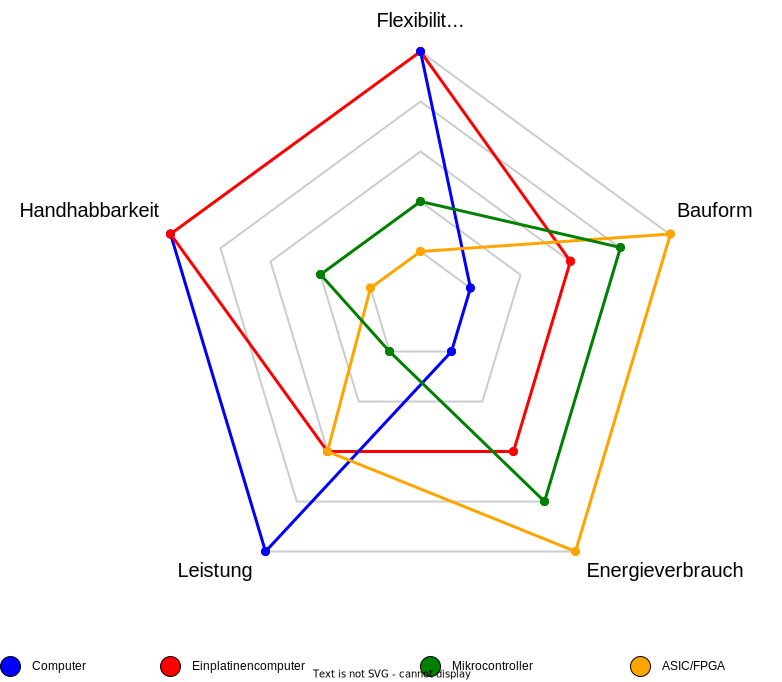

# 2.2 Hardwareauswahl

Die Auswahl der Hardware ist ein entscheidender Schritt bei der Entwicklung von TinyML-Anwendungen. Verschiedene Hardwareplattformen bieten unterschiedliche Vor- und Nachteile. Hier ist eine Gegenüberstellung einiger relevanter Hardwareoptionen:

Im folgenden sind einige Kriterien für die Hardwareauswahl, die berücksichtigt werden sollten:

* **Rechenleistung:** Edge-Geräte verfügen normalerweise über begrenzte Rechenleistung im Vergleich zu leistungsstarken Servern oder Cloud-Plattformen. Dies bedeutet, dass Modelle auf diesen Geräten effizient und optimiert sein müssen, um akzeptable Inferenzgeschwindigkeiten zu gewährleisten.
* **Speicher:** Der verfügbare Speicher auf Edge-Geräten ist oft begrenzt. Dies betrifft sowohl den Speicherplatz für das Modell selbst als auch den Arbeitsspeicher, der während der Inferenz benötigt wird. Die Modellgröße und die Ressourcenanforderungen sind daher wichtige Überlegungen.
* **Energieeffizienz:** Viele Edge-Geräte sind batteriebetrieben, und die Energieeffizienz ist entscheidend. Das Modell muss so konzipiert sein, dass es mit minimalem Energieverbrauch arbeitet, um die Batterielebensdauer zu verlängern.
* **Sensorik:** Edge-Geräte nutzen oft Sensoren, um Daten aus ihrer Umgebung zu sammeln. Die Qualität und Genauigkeit dieser Sensoren kann variieren, und das Modell sollte in der Lage sein, mit unterschiedlichen Dateneingaben umzugehen.
* **Betriebssysteme:** Edge-Geräte verwenden oft spezielle Betriebssysteme, die möglicherweise weniger Ressourcen zur Verfügung stellen als Standard-PCs oder Server. Die Integration des Modells in das spezifische Betriebssystem ist wichtig.

In der folgenden Tabelle werden Geräte hinsichtlich der ausgewählten Faktoren miteinander verglichen, wobei diese mit einer Skala von 1 bis 5 bewertet werden. Dabei bedeutet eine 1 “sehr hoch” und eine 5 “sehr niedrig”.

<table data-header-hidden data-full-width="true"><thead><tr><th></th><th></th><th></th><th></th><th></th><th></th><th></th></tr></thead><tbody><tr><td>Gerät</td><td>Größe</td><td>Preis  In Euro</td><td>* Nötige Expertise</td><td>Toolkit</td><td>* Leistung</td><td>Speicher</td></tr><tr><td>Computer</td><td>5</td><td>2 - 4</td><td>1</td><td>TensorFlow, Pytorch, AutoML, etc.</td><td>5</td><td>5</td></tr><tr><td>Handys / Tablets</td><td>4</td><td>2 - 3</td><td>1</td><td>TensorFlow Lite</td><td>3</td><td>4</td></tr><tr><td>Einplatinencomputer</td><td>3</td><td>1 - 2</td><td>1</td><td>TensorFlow, Pytorch, AutoML, etc.</td><td>5</td><td>3</td></tr><tr><td>Mikrocontroller</td><td>2</td><td>1</td><td>4</td><td>TensorFlow Lite, Cube.AI, AIfES</td><td>1</td><td>1</td></tr><tr><td>SoC/ FPGA/ ASIC</td><td>1</td><td>1 - 5</td><td>5</td><td>FINN, Caffeinated FPGA</td><td>2</td><td>2</td></tr></tbody></table>

In der folgenden Abbildung sind die Eigenschaften eines Computers, Einplatinencomputers, Microcontroller und eines AISC/FPGA zu sehen. Während der Computer volle Leistung, Handhabbarkeit und Flexibilität bietet, spart der Einplatinencomputer an Leistung, bietet aber eine etwas kleinere Bauform und hat einen geringeren Energieverbrauch. Der Mikrocontroller übertrifft den Einplatinencomputer in diesen Eigenschaften, bietet jedoch weniger Flexibilität und Handhabbarkeit, sowie Leistung. Der ASIC/FPGA hingegen hat eine vergleichbare Leistung wie der Einplatinencomputer, weniger Handhabbarkeit und Flexibilität wie der Mikrocontroller aber bietet den wenigsten Energieverbrauch und die kleinste Bauform.

<figure><figcaption>
Abbildung 33: Vergleich der verschiedenen Hardwareigenschaften
</figcaption></figure>

#### 3.2.1 **Echtzeitbedingungen und Herausforderungen**

Die Echtzeitfähigkeit ist in vielen Edge-Anwendungen entscheidend. Hier sind einige der Herausforderungen und Einschränkungen im Zusammenhang mit Echtzeit-Edge-Systemen:

* **Echtzeitverarbeitung:** In Echtzeitanwendungen müssen Modelle innerhalb eines bestimmten Zeitfensters Inferenzentscheidungen treffen. Dies erfordert effiziente Modelle und Algorithmen, um die geforderte Latenz einzuhalten.
* **Energieeffizienz:** Die Energieeffizienz ist in batteriebetriebenen Edge-Geräten von entscheidender Bedeutung. Modelle müssen so optimiert sein, dass sie mit minimalem Energieverbrauch arbeiten.
* **Datenübertragung:** In Echtzeitanwendungen kann die Übertragung von Daten an zentrale Server oder die Cloud zu lange dauern oder aus Datenschutzgründen nicht gewollt sein. Die Verarbeitung muss in diesen Fällen daher direkt auf dem Edge-Gerät erfolgen.
* **Fehlererkennung und -toleranz:** Echtzeitanwendungen erfordern oft Mechanismen zur Fehlererkennung und -toleranz, um unvorhergesehene Situationen zu bewältigen und einen stabilen Betrieb zu gewährleisten.

#### 3.2.2 **Hardwarebeschleuniger**

Hardwarebeschleuniger sind spezielle Hardwarekomponenten, die entwickelt wurden, um bestimmte Berechnungen zu beschleunigen. In Bezug auf TinyML können sie eine entscheidende Rolle spielen, um die Leistung von Modellen auf Edge-Geräten zu steigern. Hier sind einige Beispiele für Hardwarebeschleuniger und wie sie in TinyML genutzt werden können:

*   **GPU (Graphics Processing Unit):** GPUs sind leistungsstarke Hardwarebeschleuniger, die ursprünglich für Grafikberechnungen entwickelt wurden. GPUs sind besonders gut für parallelisierbare Aufgaben geeignet, wodurch sie in der Lage sind, viele einfache Berechnungen gleichzeitig durchzuführen. Im Vergleich zu anderen Hardwarebeschleunigern bieten GPUs eine breitere Palette von Anwendungen, einschließlich grafischer und rechenintensiver Aufgaben, was ihre Vielseitigkeit in Edge-Geräten unterstreicht.

    [Quelle/weitere Infos](https://blogs.nvidia.com/blog/why-gpus-are-great-for-ai/), [Quelle/weitere Infos 2](https://www.analyticsvidhya.com/blog/2023/03/cpu-vs-gpu/)
*   **TPU (Tensor Processing Unit):** TPUs sind, von Google entwickelte, speziell für Tensorflow-basierte Workloads optimiert und zeichnen sich durch ihre hohe Effizienz bei der Verarbeitung von Tensoroperationen aus. Im Vergleich zu GPUs und NPUs bieten TPUs eine höhere Leistung pro Watt für KI-Aufgaben, was sie besonders für energieeffiziente Anwendungen in der TinyML-Umgebung auszeichnet.

    [Quelle/weitere Infos](https://cloud.google.com/tpu/docs/intro-to-tpu?hl=de), [Quelle/weitere Infos 2](https://openmetal.io/docs/product-guides/private-cloud/tpu-vs-gpu-pros-and-cons/)
*   **NPU (Neural Processing Unit):** NPUs sind darauf ausgerichtet, speziell für neuronale Netzwerke optimierte Berechnungen durchzuführen. Im Unterschied zu GPUs und TPUs, die oft breiter einsetzbar sind, bieten NPUs eine spezialisierte Architektur, die auf die Anforderungen von KI-Anwendungen zugeschnitten ist. Dies ermöglicht eine höhere Energieeffizienz und Leistung für TinyML-Modelle.

    [Quelle/weitere Infos](https://www.digitaltrends.com/computing/what-is-npu/)
*   **FPGA (Field-Programmable Gate Array):** FPGAs bieten eine flexible und programmierbare Hardwarearchitektur. Im Vergleich zu festen Hardwarebeschleunigern wie GPUs, TPUs und NPUs ermöglichen FPGAs eine maßgeschneiderte Anpassung an die spezifischen Anforderungen von TinyML-Modellen. Ihre Programmierbarkeit erlaubt eine optimale Nutzung für verschiedene Aufgaben und Szenarien auf Edge-Geräten.

    [Quelle/weitere Infos](https://www.intel.com/content/www/us/en/artificial-intelligence/programmable/fpga-gpu.html)

Die Integration von Hardwarebeschleunigern erfordert oft spezielle Optimierungen und Anpassungen in der Modellentwicklung, um die Vorteile dieser Hardware voll auszuschöpfen.
