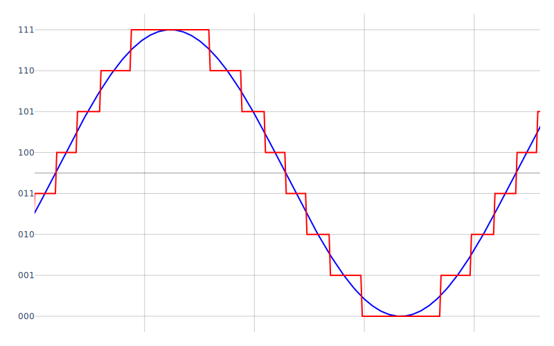
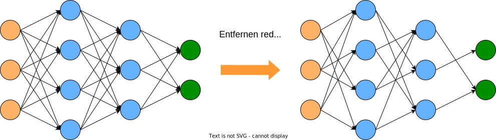
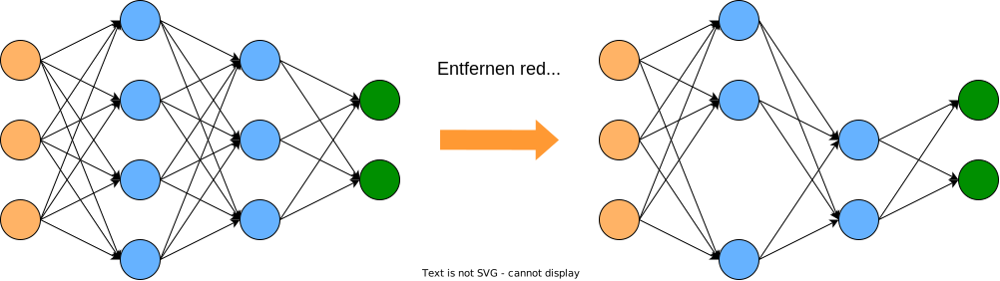
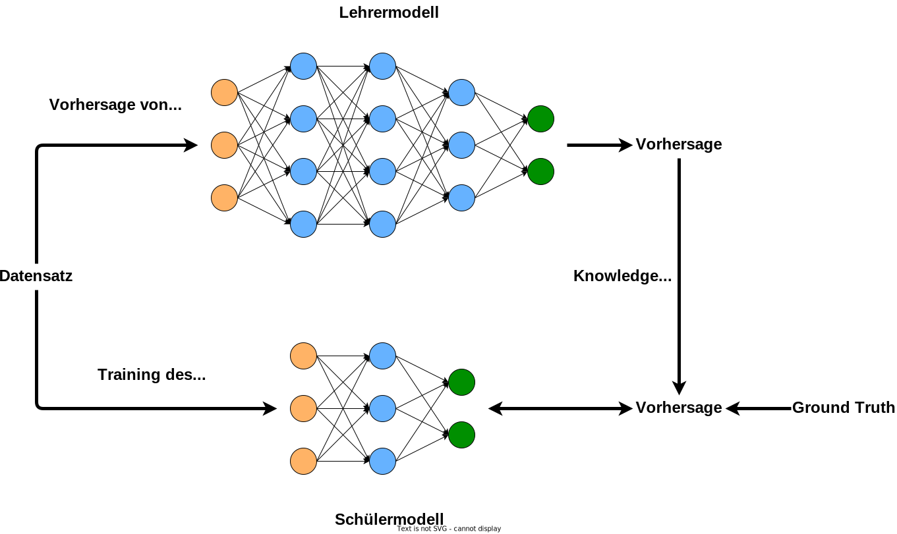

# 2.3 TinyML - Modellkomprimierung

Im folgenden werden verschiedene Methoden zur effizienten Verkleinerung von neuronalen Netzen diskutiert. Diese Techniken, darunter Quantisierung, Gewicht Pruning, strukturiertes Pruning, Knowledge Distillation und Huffman-Codierung, zielen darauf ab, die Größe von Modellen zu reduzieren, den Speicherbedarf zu verringern und die Inferenzeffizienz auf ressourcenbeschränkten Edge-Geräten zu verbessern.

#### 2.3.1 Quantisierung

Quantisierung ist der Prozess der Reduzierung der Genauigkeit von Modellparametern. Standardmäßig sind die Gewichten von neuronalen Netzen in 32-Bit aufgelöst. Ziel der Quantisierung ist, die 32-Bit Darstellung auf eine niedrigere Bit-Darstellung umzuwandeln. Gewichte und Bias werden dementsprechend von hochpräzisen Darstellungen (z. B. 32-Bit-Gleitkommazahlen) in Darstellungen mit niedrigerer Genauigkeit (z. B. 8-Bit-Ganzzahlen) umgewandelt. Dies reduziert den benötigten Speicherplatz und verbessert die Inferenz-Effizienz.

<figure><figcaption><p>Abbildung 34: Quantisierung eines kontinuierlichen Signals</p></figcaption></figure>

**Vorteile:**

* Reduzierter Speicherbedarf
* Schnellere Inferenz auf Edge-Geräten
* Effizientere Nutzung von Hardwarebeschleunigern

**Nachteile:**

* Geringere Modellgenauigkeit
* Erfordert zusätzlichen Implementierungsaufwand

**Quantisierungsarten:**

*   Statische Quantisierung:

    Die Modellparameter (Gewichte und Bias) werden vor der Inferenz quantisiert und bleiben während der Inferenz fest. Dies beinhaltet die Zuordnung von Gleitkommawerten zu einer festen Anzahl von diskreten Stufen oder ganzzahligen Darstellungen. Sie reduziert den Speicherverbrauch und beschleunigt die Inferenz, kann jedoch aufgrund der begrenzten Präzision der quantisierten Darstellungen zu einem Verlust an Modellgenauigkeit führen.
*   Dynamische Quantisierung:

    Die Modellparameter werden dynamisch während der Inferenz quantisiert, ohne vorherige Quantisierung der Gewichte. Die Quantisierung erfolgt während der Ausführung des Modells und passt sich den Eingabedaten an. Erreicht ähnliche Vorteile hinsichtlich Speicher- und Recheneffizienz wie die statische Quantisierung, während die Modellgenauigkeit möglicherweise erhalten bleibt.
*   Quantisierung-Aware Training:

    Eine Technik, um Modelle so zu trainieren, dass sie die Effekte der Quantisierung während des Trainings simulieren. Hilft den Modellen, unter reduzierter Präzision gut zu performen, indem sie während des Trainings quantisierungsbezogene Effekte berücksichtigen. Beinhaltet die Verwendung von quantisierten Operationen und simulierter Quantisierung, um das Modell toleranter gegenüber durch Quantisierung verursachten Fehlern zu machen. Das TensorFlow Model Optimization Toolkit bietet Funktionen und Tools für das Quantisierung-Aware Training

**Beispiele für Quantisierungsmethoden:**

Jede der Methoden können in den verschieden Quantisierungsarten verwendet werden.

* Lineare Skalierung: Übersetzt kontinuierliche Werte in diskrete Ebenen.
* Die Variablen sind wie folgt definiert:
  * **r\_min**: Minimum des Messbereichs
  * **r\_max**: Maximum des Messbereichs
  * **t\_min**: Minimum des gewünschten Zielbereichs
  * **t\_max**: Maximum des gewünschten Zielbereichs
  * **m**: Die zu skalierende Messung
* wird häufig verwendet, wenn eine gleichmäßige Verteilung der quantisierten Werte bevorzugt wird
* nützlich, wenn eine feine Abstufung der Werte benötigt wird, um die Genauigkeit des Modells zu erhalten, insbesondere wenn die Eingangsdaten eine breite Spannweite aufweisen.
* Potenz-von-2-Skalierung: Beschränkt Werte auf Potenzen von 2.
  * quantizedValue = round(scaleFactorrealValue) × scaleFactor
  * ermöglicht eine effiziente Umsetzung auf Hardware, die optimiert ist, um mit Potenzen von 2 zu arbeiten.
  * kann dazu beitragen, Rundungsfehler zu minimieren und die Geschwindigkeit der Berechnungen zu steigern.

```python
import tensorflow as tf
import tensorflow_model_optimization as tfmot
from tensorflow.keras.optimizers import Adam

#This function applies quantization-aware training to the model, which will simulate the effects of quantization during training.
quantize_model = tfmot.quantization.keras.quantize_model(model)
quantize_model.compile(optimizer=Adam(), loss='categorical_crossentropy', metrics=['accuracy'])

#Evaluating the Quantized Model:
quantize_model.summary()
_, quantized_model_accuracy = quantize_model.evaluate(x_test, y_test, verbose=0)
print('Quantized Model Accuracy:', quantized_model
_accuracy)
#Output: Quantized Model Accuracy: 0.08919999748468399 -> This is low!
```

#### 2.3.2 Gewichtp**runing**

Pruning bezieht sich auf das Entfernen von unwichtigen Verbindungen (Gewichten) oder Neuronen im Modell. Dies geschieht normalerweise durch die Analyse von Gewichtsgradienten während des Trainings. Im Neuronen oder Gewichte, die als unwichtig identifiziert werden, werden entfernt.

<figure><figcaption><p>Abbildung 35: Beim Gewichtpruning wird das Netz verkleinert, in dem redundante Gewichte entfernt werden</p></figcaption></figure>

**Vorteile:**

* Modellgrößenreduktion
* Geringerer Speicherbedarf
* Verbesserte Recheneffizienz
* Schnellere Inferenz auf Edge-Geräten

**Nachteile:**

* Potenzieller Genauigkeitsverlust
* Zusätzlicher Implementierungsaufwand
* Komplexe Kriterienauswahl
* Sensible Modellabhängigkeit

**Pruningprozess:**

1. Training eines Basis-Modells
2. Berechnung der Wichtigkeit:
   * Bestimmung der Wichtigkeit jedes Gewichts im Netz, oft anhand der Gewichtswerte
3. Kriterium für Pruning:
   * Festlegung eines Schwellenwerts oder Prozentsatzes, um zu entscheiden, welche Gewichtungen beschnitten werden
   * Iterative Beschränkung anhand eines Kriteriums: Gewichte oder Neuronen werden schrittweise entfernt, während das Modell weiter trainiert wird, basierend auf einem vordefinierten Kriterium wie Gewichtsgröße oder Aktivierungshäufigkeit
   * Sensitivitätsbasiertes Pruning: Gewichte oder Neuronen werden basierend auf ihrem Beitrag zur Gesamtleistung des Modells entfernt
4. Bescheidungsoperation:
   *   Entfernung von Gewichtungen, die das Kriterium erfüllen

       $$Pruned weight =\begin{cases}0 & \text{,if pruning criterion is satisfied} \\\text{original weight} & \text{,otherwise}\end{cases}$$
5. Feinabstimmung:
   * Möglichkeit zur Wiederherstellung der Modellleistung durch erneutes Training des beschnittenen Netzwerks
6. Bewertung und Analyse:
   * Auswertung des geprunten Netzes auf Validierungs- oder Testdatensätzen, um Auswirkungen auf Modellgröße und -effizienz zu bewerten und mit dem Basis-Modell zu vergleichen

```python
import tensorflow as tf
import tensorflow_model_optimization as tfmot
from tensorflow.keras.optimizers import Adam

# Compile the pruned model
pruned_model.compile(optimizer='adam', loss='sparse_categorical_crossentropy', metrics=['accuracy'])
# Prune the model with the UpdatePruningStep callback
pruned_model.fit(x_train, y_train, epochs=1, batch_size=64, validation_data=(x_test, y_test), callbacks=[UpdatePruningStep()])

# Strip the pruning wrappers from the pruned model
final_model = tfmot.sparsity.keras.strip_pruning(pruned_model)
# Apply a final pruning step to achieve the target sparsity
final_model = tfmot.sparsity.keras.prune_low_magnitude(final_model, **pruning_params)
```

#### 2.3.3 Strukturiertes Pruning

Das entwickelte Framework ermöglicht automatische strukturierte Reduzierung von neuronalen Netzwerken. Das [Automatic-Structured-Pruning Tool](https://github.com/Hahn-Schickard/Automatic-Structured-Pruning/blob/main/src/pruning.py) löscht direkt Filter oder Neuronen, reduziert Gewichte und Speicherbedarf. Der Unterschied zu weighted Pruning ist, dass dabei die weniger relevanten Neuronen gelöscht werden, statt nur auf 0 zu setzen. Das Tool bietet zwei Ansätze: die Festlegung eines Löschfaktors für Neuronen oder Filter sowie die Definition einer minimalen Genauigkeit nach dem Reduzieren. Es ist Teil von AutoFlow, das die schnelle ML-Implementierung auf eingebetteten Geräten erleichtert.

<figure><figcaption><p>Abbildung 36: Beim Strukturierten Pruning wird das Netz verkleinert, in dem redundante Neuronen entfernt werden</p></figcaption></figure>

**Vorteile:**

* Reduziert unnötige Gewichte und Speicheranforderungen, verbessert die Effizienz neuronaler Netze
* Ermöglicht gezieltes Löschen von Filtern oder Neuronen, was eine präzise Anpassung der Netzstruktur ermöglicht
* Bietet die Wahl zwischen einem festen Löschfaktor und der Definition einer minimalen Genauigkeit nach dem Pruning
* Integriert in ein umfassendes Tool, das den gesamten ML-Implementierungsprozess von der Modellerstellung bis zur Geräteoptimierung abdeckt

**Nachteile:**

* Befindet sich noch in der Entwicklung, möglicherweise sind nicht alle Funktionen oder Optimierungen vollständig implementiert
* Das Tool erfordert möglicherweise zusätzliche Einarbeitung in die Funktionsweise und die Auswahl der optimalen Pruning-Parameter
* Möglicherweise ist es nicht für alle Arten von neuronalen Netzwerken oder speziellen Anwendungsfällen geeignet

Beispiel für die allgemeine Methode des Löschens von Neuronen:

```python
def factor_pruning(keras_model, prun_factor_dense=10, prun_factor_conv=10,
                metric='L1', comp=None, num_classes=None, label_one_hot=None):
    """
    A given keras model get pruned. The factor for dense and conv says how
    many percent of the dense and conv layers should be deleted.

    Args:
        keras_model:        Model which should be pruned
        prun_factor_dense:  Integer which says how many percent of the neurons
                            should be deleted
        prun_factor_conv:   Integer which says how many percent of the filters
                            should be deleted
        metric:             Metric which should be used for model pruning
        comp:               Dictionary with compiler settings
        num_classes:        Number of different classes of the model
        label_one_hot:      Boolean value if labels are one hot encoded or not

    Return:
        pruned_model:      New model after pruning
    """

    if callable(getattr(keras_model, "predict", None)):
        model = keras_model
    elif isinstance(keras_model, str) and ".h5" in keras_model:
        model = load_model(keras_model)
    else:
        print("No model given to prune")

    if num_classes <= 2 and comp is None:
        comp = {
            "optimizer": 'adam',
            "loss": tf.keras.losses.BinaryCrossentropy(),
            "metrics": 'accuracy'}
    elif num_classes > 3 and comp is None:
        if label_one_hot:
            comp = {
                "optimizer": 'adam',
                "loss": tf.keras.losses.CategoricalCrossentropy(),
                "metrics": 'accuracy'}
        else:
            comp = {
                "optimizer": 'adam',
                "loss": tf.keras.losses.SparseCategoricalCrossentropy(),
                "metrics": 'accuracy'}

    layer_types, layer_params, layer_output_shape, layer_bias, netstr = (
        load_model_param(model))
    num_new_neurons = np.zeros(shape=len(layer_params), dtype=np.int16)
    num_new_filters = np.zeros(shape=len(layer_params), dtype=np.int16)

    layer_params, num_new_neurons, num_new_filters, layer_output_shape = (
        model_pruning(layer_types, layer_params, layer_output_shape,
                      layer_bias, netstr, num_new_neurons, num_new_filters,
                      prun_factor_dense, prun_factor_conv, metric))

    print("Finish with pruning")

    pruned_model = build_pruned_model(model, layer_params, layer_types,
                                      num_new_neurons, num_new_filters, comp)

    print("Model built")

    return pruned_model
```

#### 2.3.4 **Knowledge Distillation**

Knowledge Distillation ist ein Verfahren, bei dem ein komplexes neuronales Netz, oft als Lehrer bezeichnet, verwendet wird, um ein vereinfachtes Modell, den Schüler, zu trainieren. Das Ziel ist, das Wissen des Lehrers auf den Schüler zu übertragen. Dieser Ansatz ermöglicht es, kleinere und rechenintensivere Modelle zu erstellen, die dennoch hohe Leistung erzielen.

<figure><figcaption><p>Abbildung 37: Schematische Darstellung der Funktionsweise der Knowledge Distillation</p></figcaption></figure>

**Vorteile:**

* Modellgrößenreduktion: Durch das Wissensvermittlungsverfahren kann ein kleineres Modell trainiert werden, das weniger Speicherplatz benötigt.
* Bessere Leistung: Der Schüler kann das Wissen des Lehrers nutzen, um die Leistung zu steigern und Genauigkeit zu verbessern.
* Effizienz: Kleinere Modelle sind effizienter bei der Inferenz, insbesondere auf ressourcenbeschränkten Geräten.

**Nachteile:**

* Abhängigkeit vom Lehrer: Die Leistung des Schülers hängt stark von der Qualität des Lehrermodells ab.
* Trainingsaufwand: Der Prozess erfordert zusätzlichen Aufwand, um den Lehrer zu erstellen und den Schüler zu trainieren.
* Komplexität der Wissensvermittlung: Die Wahl der besten Methoden zur Übertragung des Wissens kann komplex sein.

**Knowledge Distillation-Prozess:**

1. Erstellen des Lehrermodells:
   * Ein komplexes Modell (der Lehrer) wird auf einem Datensatz trainiert und dient als Wissensquelle.
2. Training des Schülermodells:
   * Ein einfacheres Modell (der Schüler) wird auf demselben Datensatz trainiert, aber unter Verwendung des Wissens des Lehrers. Dies kann durch Minimierung einer kombinierten Verlustfunktion erreicht werden, die sowohl die Modellgenauigkeit als auch die Übereinstimmung mit den Vorhersagen des Lehrers berücksichtigt.
3. Feinabstimmung und Evaluierung:
   * Der Schüler kann optional weiter trainiert und auf einem Validierungs- oder Testdatensatz evaluiert werden, um die Leistung zu bewerten.

```python
import tensorflow as tf
import tensorflow_model_optimization as tfmot
from tensorflow.keras.optimizers import Adam

# Loss-Funktion für Knowledge Distillation
def knowledge_distillation_loss(y_true, y_pred):
    # Temperatur für Wissensvermittlung
    temperature = 5.0
    # Softmax mit Temperatur für Vorhersagen des Lehrermodells
    y_teacher = tf.nn.softmax(teacher_model(y_true) / temperature)
    # Softmax mit Temperatur für Vorhersagen des Schülermodells
    y_student = tf.nn.softmax(y_pred / temperature)
    # Kullback-Leibler-Divergenz als Loss-Funktion
    loss = tf.keras.losses.KLDivergence()(y_teacher, y_student)
    return loss

# Schülermodell für Knowledge Distillation kompilieren
student_model.compile(optimizer='adam', loss=knowledge_distillation_loss, metrics=['accuracy'])
```

#### 2.3.5 TinyML & AutoML

Zusätzlich zu den Techniken gibt es Tools, die bei der Optimierung von TinyML-Modellen helfen. Hier sind einige dieser Tools und ihr Zusammenhang mit TinyML:

**AutoFlow**

AutoFlow ist ein Tool zur Automatisierung des Modelltrainings und der Optimierung neuronaler Netze. Es kann verwendet werden, um Hyperparameter automatisch anzupassen und die besten Konfigurationen für Ihr TinyML-Modell zu finden. Dies spart Zeit und Ressourcen, während die Modellleistung verbessert wird.

**AutoKeras**

AutoKeras ist ein weiteres Tool zur Automatisierung des Modelltrainings. Es ermöglicht die automatische Suche nach der besten Modellarchitektur für Ihre Daten. Dies ist besonders nützlich in der Welt von TinyML, da es die Entwickler bei der Auswahl der optimalen Modellstruktur unterstützt.

Die Auswahl der Quantisierungs- und Optimierungstechniken sowie die Nutzung von Tools hängen von den spezifischen Anforderungen eines TinyML-Projekts ab. Ziel ist es, Modelle zu erstellen, die auf ressourcenbeschränkten Edge-Geräten effizient und trotzdem genau ausgeführt werden können.
